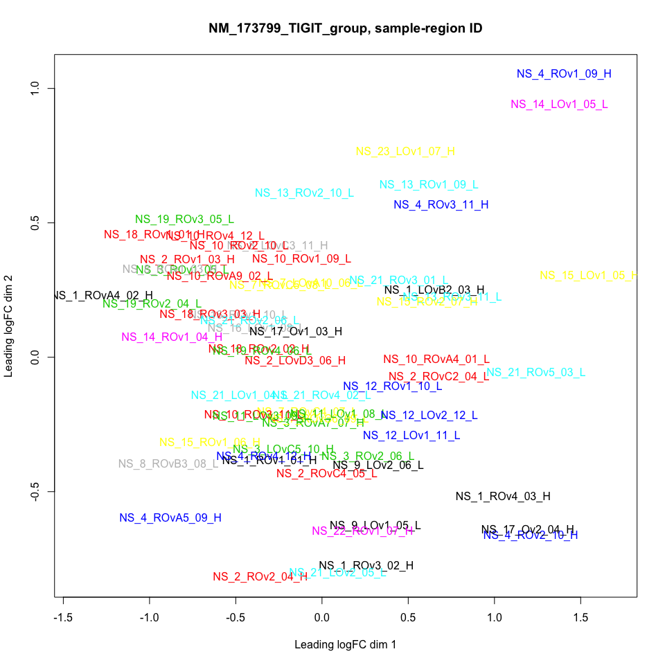

TIGIT DGE Analysis
================
BM
8/2/2021

## TIGIT Analysis

Data was obtained from the
[EGAS00001002839](https://ega-archive.org/studies/EGAS00001002839) study
and parsed
[here](https://github.com/brucemoran/kglennon_tigit/blob/master/R/parse_join_RData_EGAD00010001515.R)

Here a DGE analysis is conducted using Limma which can account for
variation based on multiple samples derived from the same
individual/tumour.

### TIGIT Groupings by median log2tpm expression

``` r
mtd <- metadata_ns_ov %>% dplyr::select(patient_id, NM_173799_TIGIT_group) %>% as.data.frame() %>% table()
knitr::kable(mtd)
```

|     | High | Low |
|:----|-----:|----:|
| 1   |    5 |   0 |
| 10  |    0 |   6 |
| 11  |    0 |   2 |
| 12  |    0 |   3 |
| 13  |    0 |   3 |
| 14  |    1 |   1 |
| 15  |    3 |   0 |
| 16  |    0 |   2 |
| 17  |    2 |   0 |
| 18  |    3 |   0 |
| 19  |    0 |   3 |
| 2   |    3 |   2 |
| 21  |    0 |   6 |
| 22  |    1 |   0 |
| 23  |    1 |   0 |
| 3   |    2 |   2 |
| 4   |    5 |   0 |
| 7   |    0 |   4 |
| 8   |    2 |   1 |
| 9   |    0 |   2 |

### DGE Analysis based on TIGIT median grouping

``` r
dge <- edgeR::DGEList(counts = raw_count_ov_dge)
norm_fac <- EGAD00010001515_raw_count_tb %>% 
            dplyr::filter(!CodeClass %in% c("Endogenous", "Negative")) %>% 
            dplyr::select(!!colnames(raw_count_ov_dge)) %>%
            dplyr::summarise(across(where(is.numeric), sum)) %>% 
            dplyr::mutate(across(where(is.numeric), ~ 1 /.x))
dge$samples$norm.factors <- unlist(norm_fac)

##model includes site, sample_type (FFPE, FF) and patient_id
design <- model.matrix(~ 0 + NM_173799_TIGIT_group + sample_type, metadata_ns_ov)
colnames(design) <- make.names(colnames(design))
#keep <- edgeR::filterByExpr(dge, design)
#dge <- dge[keep, keep.lib.sizes=FALSE]
#dge <- edgeR::calcNormFactors(dge)

##MDS plots
col_patient_id <- metadata_ns_ov$patient_id
levels(col_patient_id) <-  sample(rainbow(nlevels(col_patient_id)))
col_patient_id <- as.character(col_patient_id)
lcpm <- edgeR::cpm(dge, log = TRUE, prior.count = 0.5, group = "NM_173799_TIGIT_group")
med_high <- unlist(lapply(strsplit(as.vector(metadata_ns_ov$NM_173799_TIGIT_group),""),function(f){f[1]}))
condNames <- paste0(metadata_ns_ov$ns_sample_region_id, "_", med_high)
plotMDS(lcpm, labels = condNames, col = col_patient_id, cex = 1)
title(main="NM_173799_TIGIT_group, sample-region ID")
```

<!-- -->

``` r
condNames <- med_high
plotMDS(lcpm, labels = condNames, col = col_patient_id, cex = 2)
title(main="NM_173799_TIGIT_group, High-Low only")
```

<!-- -->

``` r
##voom
dcv <- voom(dge, design, plot=FALSE)

##DC: https://support.bioconductor.org/p/94280/#94290; https://support.bioconductor.org/p/59700/
dccor <- limma::duplicateCorrelation(dcv, block = metadata_ns_ov$patient_id)
dccor$consensus.correlation
```

    ## [1] -0.01692907

``` r
dcdcv <- limma::voom(dge, design, correlation=dccor$consensus.correlation, block = metadata_ns_ov$patient_id)

##second time around: https://support.bioconductor.org/p/115484/
dccor <- limma::duplicateCorrelation(dcdcv, block=metadata_ns_ov$patient_id)
dccor$consensus.correlation
```

    ## [1] -0.01694087

``` r
dcdcv <- limma::voom(dge, design, correlation=dccor$consensus.correlation, block = metadata_ns_ov$patient_id)

dcfit <- limma::lmFit(dcdcv, design, cor=dccor$consensus.correlation, block = metadata_ns_ov$patient_id)
dcmc <- makeContrasts(
          LowHigh = NM_173799_TIGIT_groupLow - NM_173799_TIGIT_groupHigh,
          levels=colnames(design))
dcfitmc <- contrasts.fit(dcfit, dcmc)
dcfitmc <- eBayes(dcfitmc, robust=TRUE)
summary(decideTests(dcfitmc))
```

    ##        LowHigh
    ## Down         0
    ## NotSig     760
    ## Up           0

``` r
TIGIT_High_vs_Low_tb <- tibble::as_tibble(topTreat(dcfitmc, coef=1, n=Inf), rownames="Accession_nv") %>%
                        dplyr::left_join(raw_count_tb[,c(2,4)], .) %>%
                        dplyr::arrange(adj.P.Val, decreasing = FALSE) %>%
                        dplyr::mutate(absFC = 2^logFC) %>%
                        dplyr::mutate(fgseaRank = seq(1:length(t))) 
```

    ## Joining, by = "Accession_nv"

### Sanity check logFC direction

<!-- -->

``` r
knitr::kable(TIGIT_High_vs_Low_tb)
```

| Name                         | Accession\_nv   |      logFC |  AveExpr |          t |   P.Value | adj.P.Val |          B |     absFC | fgseaRank |
|:-----------------------------|:----------------|-----------:|---------:|-----------:|----------:|----------:|-----------:|----------:|----------:|
| TNF                          | NM\_000594      |  1.1021686 | 22.80157 |  3.4915706 | 0.0008490 | 0.1298709 | -0.7028313 | 2.1467714 |         1 |
| C1R                          | NM\_001733      |  0.6080787 | 27.81114 |  3.4895569 | 0.0008544 | 0.1298709 | -0.7011871 | 1.5242279 |         2 |
| CCL18                        | NM\_002988      |  1.2874294 | 21.70867 |  3.7242922 | 0.0004005 | 0.1298709 | -0.1305810 | 2.4409274 |         3 |
| LIF                          | NM\_002309      |  0.9986332 | 23.30811 |  3.5774402 | 0.0006455 | 0.1298709 | -0.4658927 | 1.9981062 |         4 |
| CXCL1                        | NM\_001511      |  1.3868944 | 23.95593 |  3.6021809 | 0.0006030 | 0.1298709 | -0.3959137 | 2.6151512 |         5 |
| IL1B                         | NM\_000576      |  0.8663370 | 22.45405 |  3.4204572 | 0.0010622 | 0.1345392 | -0.8918341 | 1.8230284 |         6 |
| FPR2                         | NM\_001462      |  0.7244422 | 20.49490 |  3.2290830 | 0.0019147 | 0.1572067 | -1.4059563 | 1.6522617 |         7 |
| IL8                          | NM\_000584      |  1.1278317 | 24.39875 |  3.1800624 | 0.0022250 | 0.1572067 | -1.4760220 | 2.1853006 |         8 |
| TNFSF14                      | NM\_003807      |  0.8665875 | 21.96804 |  3.2098218 | 0.0020295 | 0.1572067 | -1.4206499 | 1.8233449 |         9 |
| IL23A                        | NM\_016584      |  0.7438129 | 20.46451 |  3.2181050 | 0.0019794 | 0.1572067 | -1.4336934 | 1.6745958 |        10 |
| CXCL3                        | NM\_002090      |  0.9123592 | 22.33757 |  3.1717572 | 0.0022754 | 0.1572067 | -1.5093748 | 1.8821207 |        11 |
| CXCL6                        | NM\_002993      |  1.4908512 | 21.39453 |  3.1253291 | 0.0026372 | 0.1670234 | -1.6501501 | 2.8105476 |        12 |
| S100B                        | NM\_006272      |  0.8404487 | 20.97995 |  2.9600119 | 0.0042335 | 0.2298206 | -2.0205043 | 1.7906070 |        13 |
| CXCL2                        | NM\_002089      |  0.8767969 | 24.19995 |  2.9814290 | 0.0039806 | 0.2298206 | -1.9543268 | 1.8362938 |        14 |
| ICAM1                        | NM\_000201      |  0.6531671 | 24.86184 |  2.9073891 | 0.0049195 | 0.2492567 | -2.1287912 | 1.5726167 |        15 |
| TNFAIP3                      | NM\_006290      |  0.5483853 | 25.23633 |  2.7955779 | 0.0067308 | 0.2743111 | -2.3846595 | 1.4624480 |        16 |
| C1S                          | NM\_001734      |  0.6008168 | 26.80652 |  2.7779175 | 0.0070674 | 0.2743111 | -2.4177390 | 1.5165750 |        17 |
| NFKBIA                       | NM\_020529      |  0.3763562 | 27.85153 |  2.7702307 | 0.0072187 | 0.2743111 | -2.4315617 | 1.2980592 |        18 |
| CCL20                        | NM\_004591      |  1.2717516 | 23.09726 |  2.7786209 | 0.0070991 | 0.2743111 | -2.4165226 | 2.4145455 |        19 |
| CD1C                         | NM\_001765      |  0.7147884 | 20.20911 |  2.7889522 | 0.0068553 | 0.2743111 | -2.3957834 | 1.6412425 |        20 |
| KIR\_Activating\_Subgroup\_1 | NM\_001083539   | -0.7845513 | 18.16413 | -2.7269350 | 0.0081278 | 0.2941486 | -2.5332148 | 0.5805325 |        21 |
| TLR8                         | NM\_016610      |  0.5039039 | 20.75793 |  2.6286425 | 0.0105926 | 0.3220141 | -2.7267309 | 1.4180456 |        22 |
| SERPINB2                     | NM\_002575      |  0.9227741 | 19.96723 |  2.6463472 | 0.0101037 | 0.3220141 | -2.6918049 | 1.8957570 |        23 |
| PPBP                         | NM\_002704      |  0.7711121 | 19.14099 |  2.6386035 | 0.0103149 | 0.3220141 | -2.7084873 | 1.7065848 |        24 |
| CCL21                        | NM\_002989      |  1.1746436 | 21.05742 |  2.6456824 | 0.0101635 | 0.3220141 | -2.6942987 | 2.2573711 |        25 |
| IL17RA                       | NM\_014339      |  0.3306097 | 23.43171 |  2.5830411 | 0.0119523 | 0.3450738 | -2.8383465 | 1.2575447 |        26 |
| SELE                         | NM\_000450      |  0.7106234 | 18.99367 |  2.5734030 | 0.0122592 | 0.3450738 | -2.8391311 | 1.6365111 |        27 |
| TPSAB1                       | NM\_003294      |  0.8955694 | 22.18114 |  2.5382940 | 0.0134384 | 0.3567016 | -2.9172161 | 1.8603440 |        28 |
| CD1A                         | NM\_001763      |  1.0324319 | 19.77490 |  2.5333916 | 0.0136110 | 0.3567016 | -2.9168983 | 2.0454694 |        29 |
| CCL17                        | NM\_002987      |  0.7119165 | 20.06417 |  2.5125078 | 0.0143687 | 0.3640083 | -2.9576936 | 1.6379786 |        30 |
| CD83                         | NM\_004233      |  0.3712913 | 24.03543 |  2.3902650 | 0.0196168 | 0.4463966 | -3.2395547 | 1.2935101 |        31 |
| CCR3                         | NM\_001837      |  0.6138112 | 18.81925 |  2.3831299 | 0.0199704 | 0.4463966 | -3.2013213 | 1.5302965 |        32 |
| OSM                          | NM\_020530      |  0.5648380 | 20.71785 |  2.3922364 | 0.0195201 | 0.4463966 | -3.1900719 | 1.4792214 |        33 |
| S100A12                      | NM\_005621      |  0.6321191 | 19.98099 |  2.4126043 | 0.0185457 | 0.4463966 | -3.1488089 | 1.5498398 |        34 |
| IL1R1                        | NM\_000877      |  0.5267767 | 25.26876 |  2.3591201 | 0.0212022 | 0.4603916 | -3.3090051 | 1.4407067 |        35 |
| SBNO2                        | NM\_014963      |  0.3618806 | 24.49715 |  2.3352757 | 0.0224921 | 0.4748341 | -3.3538293 | 1.2851000 |        36 |
| CXCR2                        | NM\_001557      |  0.5455186 | 20.15239 |  2.2966123 | 0.0247322 | 0.4838606 | -3.3642253 | 1.4595449 |        37 |
| CEBPB                        | NM\_005194      |  0.4139588 | 26.83514 |  2.3000962 | 0.0245226 | 0.4838606 | -3.4074242 | 1.3323368 |        38 |
| CARD9                        | NM\_052813      |  0.4879014 | 22.58762 |  2.2944044 | 0.0248659 | 0.4838606 | -3.3929459 | 1.4024034 |        39 |
| CD47                         | NM\_001777      |  0.4541014 | 28.51746 |  2.2846159 | 0.0254663 | 0.4838606 | -3.4195662 | 1.3699292 |        40 |
| CTSG                         | NM\_001911      |  0.6183139 | 19.03963 |  2.2639040 | 0.0267792 | 0.4852857 | -3.4177726 | 1.5350800 |        41 |
| NLRP3                        | NM\_001079821   |  0.4770864 | 21.89241 |  2.2632999 | 0.0268184 | 0.4852857 | -3.4414946 | 1.3919297 |        42 |
| BTLA                         | NM\_181780      |  0.4431414 | 20.91281 |  2.2393985 | 0.0284095 | 0.5021212 | -3.4711124 | 1.3595615 |        43 |
| IL7R                         | NM\_002185      |  0.6614881 | 22.78313 |  2.1759217 | 0.0330450 | 0.5504736 | -3.6290182 | 1.5817132 |        44 |
| RELB                         | NM\_006509      |  0.3292109 | 23.57101 |  2.1724306 | 0.0333181 | 0.5504736 | -3.6442664 | 1.2563261 |        45 |
| IL26                         | NM\_018402      |  0.5705706 | 18.44162 |  2.1728070 | 0.0332886 | 0.5504736 | -3.5735479 | 1.4851109 |        46 |
| IL1A                         | NM\_000575      |  0.6770965 | 19.10340 |  2.1236178 | 0.0373490 | 0.5706322 | -3.6600548 | 1.5989186 |        47 |
| LTB                          | NM\_002341      |  0.6592023 | 23.18794 |  2.1214507 | 0.0375374 | 0.5706322 | -3.7312311 | 1.5792092 |        48 |
| CR1                          | NM\_000651      |  0.5123855 | 22.94807 |  2.0880763 | 0.0405449 | 0.5706322 | -3.7739814 | 1.4264068 |        49 |
| PTGS2                        | NM\_000963      |  0.6932108 | 21.70317 |  2.1037853 | 0.0391042 | 0.5706322 | -3.7122660 | 1.6168779 |        50 |
| CCR4                         | NM\_005508      |  0.4229074 | 19.72584 |  2.1133255 | 0.0382512 | 0.5706322 | -3.6820145 | 1.3406266 |        51 |
| IL21                         | NM\_021803      |  0.5201309 | 18.56532 |  2.0943337 | 0.0399656 | 0.5706322 | -3.7057197 | 1.4340854 |        52 |
| IL12A                        | NM\_000882      |  0.7113933 | 21.93918 |  2.0967043 | 0.0397480 | 0.5706322 | -3.7344941 | 1.6373846 |        53 |
| IFITM1                       | NM\_003641      |  0.4987294 | 28.48161 |  2.0909618 | 0.0402769 | 0.5706322 | -3.7712951 | 1.4129685 |        54 |
| TICAM1                       | NM\_014261      |  0.3121411 | 23.20557 |  2.0723662 | 0.0420315 | 0.5807987 | -3.8113695 | 1.2415489 |        55 |
| CXCL5                        | NM\_002994      |  0.6773997 | 20.69805 |  2.0530810 | 0.0439206 | 0.5960652 | -3.7867246 | 1.5992547 |        56 |
| IL6                          | NM\_000600      |  0.5946296 | 20.72808 |  2.0222784 | 0.0470899 | 0.6278649 | -3.8426565 | 1.5100848 |        57 |
| CLEC4A                       | NM\_194448      |  0.2958909 | 22.52571 |  2.0108224 | 0.0483178 | 0.6331292 | -3.8976299 | 1.2276428 |        58 |
| SPANXB1                      | NM\_032461      |  0.4880205 | 18.32480 |  1.9954290 | 0.0500109 | 0.6442079 | -3.8614869 | 1.4025191 |        59 |
| CCL26                        | NM\_006072      |  0.4954459 | 19.69664 |  1.9379942 | 0.0567839 | 0.7164801 | -3.9659751 | 1.4097564 |        60 |
| AMBP                         | NM\_001633      | -0.4998310 | 18.37037 | -1.9322136 | 0.0575070 | 0.7164801 | -3.9619723 | 0.7071896 |        61 |
| MAGEA4                       | NM\_001011548   | -1.0561001 | 19.89183 | -1.9022742 | 0.0614924 | 0.7537775 | -4.0174813 | 0.4809303 |        62 |
| CD40                         | NM\_001250      | -0.3975070 | 24.70039 | -1.8756381 | 0.0650054 | 0.7744058 | -4.1775315 | 0.7591690 |        63 |
| C3                           | NM\_000064      |  0.8649083 | 26.85448 |  1.8749792 | 0.0652131 | 0.7744058 | -4.1440098 | 1.8212240 |        64 |
| IKBKE                        | NM\_014002      |  0.3091940 | 24.66850 |  1.8634060 | 0.0667308 | 0.7802365 | -4.1963222 | 1.2390153 |        65 |
| TXNIP                        | NM\_006472      | -0.2619028 | 27.94464 | -1.8516397 | 0.0684266 | 0.7879430 | -4.1726908 | 0.8339872 |        66 |
| CCL3L1                       | NM\_021006      |  0.4823635 | 23.46139 |  1.8404653 | 0.0700706 | 0.7948306 | -4.2133304 | 1.3970305 |        67 |
| CCR7                         | NM\_001838      |  0.4538337 | 20.16612 |  1.8227130 | 0.0727503 | 0.7987847 | -4.1483043 | 1.3696751 |        68 |
| CSF3R                        | NM\_156038      |  0.3910697 | 22.45112 |  1.8267665 | 0.0721310 | 0.7987847 | -4.1918159 | 1.3113653 |        69 |
| CCL11                        | NM\_002986      |  0.7923652 | 21.05068 |  1.8179423 | 0.0735723 | 0.7987847 | -4.1815324 | 1.7319115 |        70 |
| MAP3K5                       | NM\_005923      |  0.2995990 | 24.69047 |  1.8013410 | 0.0760897 | 0.8031689 | -4.2949283 | 1.2308022 |        71 |
| CFI                          | NM\_000204      |  0.4764561 | 26.95650 |  1.8073460 | 0.0751387 | 0.8031689 | -4.2594794 | 1.3913218 |        72 |
| APOE                         | NM\_000041      | -0.3745417 | 27.95853 | -1.7847758 | 0.0787651 | 0.8089385 | -4.2738576 | 0.7713504 |        73 |
| MEFV                         | NM\_000243      |  0.3068589 | 19.63598 |  1.7878810 | 0.0782577 | 0.8089385 | -4.1900918 | 1.2370115 |        74 |
| SMPD3                        | NM\_018667      | -0.4775057 | 19.99554 | -1.7607467 | 0.0827846 | 0.8140553 | -4.2320321 | 0.7182183 |        75 |
| IL11                         | NM\_000641      |  0.4989511 | 20.26789 |  1.7611066 | 0.0827231 | 0.8140553 | -4.2395592 | 1.4131857 |        76 |
| ARG1                         | NM\_000045      |  0.4730874 | 18.12140 |  1.7562939 | 0.0835478 | 0.8140553 | -4.2170769 | 1.3880769 |        77 |
| CD97                         | NM\_078481      | -0.3300623 | 25.22115 | -1.7590867 | 0.0830684 | 0.8140553 | -4.3601892 | 0.7955021 |        78 |
| FCER1A                       | NM\_002001      |  0.5834153 | 20.56601 |  1.7260922 | 0.0888794 | 0.8361786 | -4.2899337 | 1.4983922 |        79 |
| ITGA2B                       | NM\_000419      |  0.5804223 | 21.26630 |  1.7242142 | 0.0892200 | 0.8361786 | -4.3063562 | 1.4952869 |        80 |
| IFNGR1                       | NM\_000416      |  0.2214063 | 25.48569 |  1.7235250 | 0.0893452 | 0.8361786 | -4.4121964 | 1.1658695 |        81 |
| CD1B                         | NM\_001764      |  0.6187826 | 17.91940 |  1.7187378 | 0.0902193 | 0.8361786 | -4.2698034 | 1.5355789 |        82 |
| CXCL16                       | NM\_001100812   |  0.3108346 | 25.16328 |  1.6920325 | 0.0952250 | 0.8587871 | -4.4606991 | 1.2404251 |        83 |
| IL7                          | NM\_000880      |  0.3189981 | 19.72011 |  1.6877498 | 0.0960486 | 0.8587871 | -4.3333351 | 1.2474639 |        84 |
| POU2AF1                      | NM\_006235      | -0.5760568 | 20.57555 | -1.6990918 | 0.0938802 | 0.8587871 | -4.3296641 | 0.6707947 |        85 |
| CD33                         | NM\_001177608   |  0.2528925 | 21.13200 |  1.6544615 | 0.1026502 | 0.8765633 | -4.4041006 | 1.1915938 |        86 |
| NCR1                         | NM\_004829      | -0.4546243 | 18.79767 | -1.6659634 | 0.1003286 | 0.8765633 | -4.3538541 | 0.7297002 |        87 |
| CD19                         | NM\_001770      | -0.4868475 | 21.58042 | -1.6611392 | 0.1012971 | 0.8765633 | -4.4041251 | 0.7135827 |        88 |
| PLAUR                        | NM\_001005376   |  0.3122009 | 24.23540 |  1.6600337 | 0.1015201 | 0.8765633 | -4.5013132 | 1.2416004 |        89 |
| CKLF                         | NM\_181640      |  0.2893395 | 25.43475 |  1.6484947 | 0.1038716 | 0.8771382 | -4.5229954 | 1.2220806 |        90 |
| IRAK4                        | NM\_016123      |  0.2460635 | 24.05763 |  1.6357586 | 0.1065183 | 0.8896032 | -4.5301733 | 1.1859667 |        91 |
| CCL3                         | NM\_002983      |  0.3938861 | 22.91451 |  1.6218122 | 0.1094789 | 0.9043906 | -4.5165080 | 1.3139278 |        92 |
| CFB                          | NM\_001710      |  0.7341407 | 26.77749 |  1.6066002 | 0.1129079 | 0.9226882 | -4.5542196 | 1.6634064 |        93 |
| AMICA1                       | NM\_153206      |  0.3057283 | 22.91365 |  1.5900503 | 0.1164697 | 0.9416698 | -4.5530504 | 1.2360425 |        94 |
| TNFRSF18                     | NM\_004195      |  0.3729124 | 21.65211 |  1.5815231 | 0.1184064 | 0.9451248 | -4.5087892 | 1.2949644 |        95 |
| C8G                          | NM\_000606      |  0.3781768 | 20.71340 |  1.5741846 | 0.1200937 | 0.9451248 | -4.5003780 | 1.2996983 |        96 |
| TRAF2                        | NM\_021138      |  0.2400705 | 25.15616 |  1.5718788 | 0.1206278 | 0.9451248 | -4.6331959 | 1.1810503 |        97 |
| EBI3                         | NM\_005755      |  0.2475414 | 20.52930 |  1.4838863 | 0.1424671 | 0.9579090 | -4.6115791 | 1.1871822 |        98 |
| BID                          | NM\_001196      |  0.2711466 | 21.47529 |  1.4956943 | 0.1393675 | 0.9579090 | -4.6128796 | 1.2067666 |        99 |
| IFNA2                        | NM\_000605      |  0.3045767 | 18.44515 |  1.4539448 | 0.1505690 | 0.9579090 | -4.6153166 | 1.2350562 |       100 |
| ITGAX                        | NM\_000887      |  0.2854007 | 23.62875 |  1.5093633 | 0.1358461 | 0.9579090 | -4.6927336 | 1.2187487 |       101 |
| FOS                          | NM\_005252      |  0.5905296 | 28.36648 |  1.4810354 | 0.1432999 | 0.9579090 | -4.6879803 | 1.5057995 |       102 |
| CCL23                        | NM\_145898      |  0.4575347 | 18.08391 |  1.4514903 | 0.1512488 | 0.9579090 | -4.6167211 | 1.3731933 |       103 |
| ICOSLG                       | NM\_015259      |  0.2711817 | 23.71070 |  1.5104578 | 0.1355672 | 0.9579090 | -4.6782896 | 1.2067959 |       104 |
| TNFRSF1A                     | NM\_001065      |  0.2243402 | 25.68333 |  1.5332536 | 0.1298604 | 0.9579090 | -4.6811437 | 1.1682429 |       105 |
| CD58                         | NM\_001779      |  0.2141110 | 23.90708 |  1.4711323 | 0.1458754 | 0.9579090 | -4.7471520 | 1.1599889 |       106 |
| NFKB1                        | NM\_003998      |  0.1928477 | 23.27709 |  1.5355474 | 0.1292969 | 0.9579090 | -4.6307372 | 1.1430176 |       107 |
| SIGIRR                       | NM\_021805      |  0.3290127 | 24.36682 |  1.5310869 | 0.1303945 | 0.9579090 | -4.6805524 | 1.2561534 |       108 |
| IL2RA                        | NM\_000417      |  0.3105868 | 22.46214 |  1.4628021 | 0.1481357 | 0.9579090 | -4.6926413 | 1.2402120 |       109 |
| CCR6                         | NM\_031409      |  0.3447635 | 19.93723 |  1.4712656 | 0.1458394 | 0.9579090 | -4.6167673 | 1.2699428 |       110 |
| C6                           | NM\_000065      |  0.4841983 | 20.35901 |  1.4684005 | 0.1466136 | 0.9579090 | -4.6259473 | 1.3988083 |       111 |
| LILRB2                       | NM\_005874      |  0.2979668 | 21.98703 |  1.4957458 | 0.1393541 | 0.9579090 | -4.6413605 | 1.2294106 |       112 |
| FUT7                         | NM\_004479      |  0.2973142 | 19.11421 |  1.5326078 | 0.1300194 | 0.9579090 | -4.5302251 | 1.2288546 |       113 |
| KIR\_Inhibiting\_Subgroup\_2 | NM\_014511      | -0.4034613 | 18.53780 | -1.4872515 | 0.1415783 | 0.9579090 | -4.5761778 | 0.7560422 |       114 |
| MAP2K4                       | NM\_003010      |  0.2877371 | 24.22710 |  1.5201088 | 0.1331274 | 0.9579090 | -4.6930127 | 1.2207240 |       115 |
| TXK                          | NM\_003328      |  0.4611773 | 21.53367 |  1.5177110 | 0.1337303 | 0.9579090 | -4.5879727 | 1.3766648 |       116 |
| CCR9                         | NM\_031200      |  0.4160211 | 17.95181 |  1.5530068 | 0.1250710 | 0.9579090 | -4.4846693 | 1.3342427 |       117 |
| CD207                        | NM\_015717      |  0.6158898 | 20.51027 |  1.4562210 | 0.1499446 | 0.9579090 | -4.6400826 | 1.5325029 |       118 |
| CCL4                         | NM\_002984      |  0.3784633 | 23.51620 |  1.5410655 | 0.1279492 | 0.9579090 | -4.6491203 | 1.2999565 |       119 |
| EGR1                         | NM\_001964      |  0.5711723 | 25.09852 |  1.4529378 | 0.1509708 | 0.9579090 | -4.7877347 | 1.4857304 |       120 |
| TNFRSF9                      | NM\_001561      |  0.3545210 | 20.82061 |  1.4366259 | 0.1554167 | 0.9681697 | -4.6788248 | 1.2785610 |       121 |
| CCL13                        | NM\_005408      |  0.4521985 | 21.36245 |  1.4407428 | 0.1542535 | 0.9681697 | -4.6921984 | 1.3681236 |       122 |
| CLEC6A                       | NM\_001007033   |  0.3619725 | 18.80764 |  1.4263323 | 0.1583549 | 0.9784528 | -4.6524150 | 1.2851818 |       123 |
| CD9                          | NM\_001769      |  0.3412301 | 28.41257 |  1.4147579 | 0.1617097 | 0.9911241 | -4.7803657 | 1.2668363 |       124 |
| CCL19                        | NM\_006274      |  0.5100345 | 21.21108 |  1.4084273 | 0.1635677 | 0.9912480 | -4.7342830 | 1.4240842 |       125 |
| CD5                          | NM\_014207      |  0.4113463 | 20.72990 |  1.4058175 | 0.1643385 | 0.9912480 | -4.7116575 | 1.3299263 |       126 |
| PPL                          | NM\_002705      |  0.2766360 | 25.15200 |  0.9570876 | 0.3419189 | 0.9999368 | -5.3226240 | 1.2113670 |       127 |
| C4BPA                        | NM\_000715      |  0.0012820 | 18.66578 |  0.0052062 | 0.9958613 | 0.9999368 | -5.4988723 | 1.0008890 |       128 |
| C7                           | NM\_000587      | -0.3467934 | 25.90218 | -0.4668945 | 0.6421428 | 0.9999368 | -5.6321941 | 0.7863299 |       129 |
| CASP10                       | NM\_032977      |  0.0046459 | 20.19895 |  0.0239345 | 0.9809751 | 0.9999368 | -5.5356040 | 1.0032255 |       130 |
| PBK                          | NM\_018492      |  0.3345867 | 23.27109 |  1.3281609 | 0.1885727 | 0.9999368 | -4.8897467 | 1.2610161 |       131 |
| CCL25                        | NM\_005624      | -0.3969750 | 20.04690 | -1.0428433 | 0.3007201 | 0.9999368 | -5.0686575 | 0.7594490 |       132 |
| CD1D                         | NM\_001766      | -0.0594004 | 21.13799 | -0.2979917 | 0.7666196 | 0.9999368 | -5.5223509 | 0.9596629 |       133 |
| TFRC                         | NM\_003234      |  0.2538978 | 26.45064 |  1.0276547 | 0.3077598 | 0.9999368 | -5.2377970 | 1.1924244 |       134 |
| CD24                         | NM\_013230      | -0.1111042 | 28.55214 | -0.3168362 | 0.7523401 | 0.9999368 | -5.6100009 | 0.9258792 |       135 |
| TNFRSF14                     | NM\_003820      | -0.0605087 | 25.08842 | -0.3700940 | 0.7124645 | 0.9999368 | -5.6750618 | 0.9589259 |       136 |
| DDX43                        | NM\_018665      |  0.1892627 | 19.79488 |  0.5605822 | 0.5769277 | 0.9999368 | -5.3863654 | 1.1401809 |       137 |
| IL13RA2                      | NM\_000640      | -0.7066344 | 19.51506 | -1.3340920 | 0.1867508 | 0.9999368 | -4.7674703 | 0.6127479 |       138 |
| IL5                          | NM\_000879      |  0.2031884 | 17.57252 |  0.6483496 | 0.5189458 | 0.9999368 | -5.2989810 | 1.1512398 |       139 |
| GAGE1                        | NM\_001040663   |  0.0942821 | 18.97625 |  0.2677875 | 0.7896748 | 0.9999368 | -5.4713550 | 1.0675341 |       140 |
| ETS1                         | NM\_005238      | -0.0850324 | 25.20332 | -0.4385936 | 0.6623486 | 0.9999368 | -5.6489724 | 0.9427633 |       141 |
| INPP5D                       | NM\_005541      |  0.0831931 | 23.70769 |  0.4715725 | 0.6387440 | 0.9999368 | -5.6038677 | 1.0593601 |       142 |
| CD53                         | NM\_001040033   |  0.2001927 | 24.97598 |  1.0053442 | 0.3183009 | 0.9999368 | -5.2788450 | 1.1488518 |       143 |
| TICAM2                       | NM\_021649      |  0.0677500 | 22.47359 |  0.5113717 | 0.6107500 | 0.9999368 | -5.5130936 | 1.0480809 |       144 |
| PIN1                         | NM\_006221      | -0.1148232 | 24.61981 | -0.4701519 | 0.6397533 | 0.9999368 | -5.6314498 | 0.9234955 |       145 |
| C4B                          | NM\_001002029   |  0.0201596 | 26.91212 |  0.0771137 | 0.9387599 | 0.9999368 | -5.6907664 | 1.0140717 |       146 |
| KIR3DL1                      | NM\_013289      |  0.1112392 | 18.50773 |  0.4369972 | 0.6635002 | 0.9999368 | -5.4190051 | 1.0801556 |       147 |
| ITGB1                        | NM\_033666      |  0.2033945 | 28.38372 |  0.8077211 | 0.4220722 | 0.9999368 | -5.3652765 | 1.1514043 |       148 |
| IL17F                        | NM\_052872      | -0.0717580 | 18.44278 | -0.2872491 | 0.7747965 | 0.9999368 | -5.4579272 | 0.9514779 |       149 |
| SPP1                         | NM\_000582      |  0.1891286 | 28.36720 |  0.6003593 | 0.5502657 | 0.9999368 | -5.5005514 | 1.1400749 |       150 |
| LGALS3                       | NM\_001177388   |  0.1664811 | 27.18061 |  0.7810148 | 0.4375087 | 0.9999368 | -5.4130240 | 1.1223177 |       151 |
| GZMB                         | NM\_004131      |  0.2522597 | 22.04897 |  0.6752770 | 0.5017933 | 0.9999368 | -5.3994677 | 1.1910713 |       152 |
| CCL28                        | NM\_148672      | -0.1366461 | 21.21284 | -0.2682007 | 0.7893799 | 0.9999368 | -5.5274019 | 0.9096314 |       153 |
| CARD11                       | NM\_032415      |  0.2476150 | 23.07071 |  0.8327010 | 0.4079331 | 0.9999368 | -5.3473032 | 1.1872428 |       154 |
| ATM                          | NM\_000051      | -0.0155736 | 21.18500 | -0.0871740 | 0.9307898 | 0.9999368 | -5.5503086 | 0.9892632 |       155 |
| ELK1                         | NM\_005229      | -0.2987152 | 24.72000 | -1.1862764 | 0.2396480 | 0.9999368 | -5.0961873 | 0.8129761 |       156 |
| RORA                         | NM\_134261      |  0.1812133 | 23.62863 |  0.7778925 | 0.4393349 | 0.9999368 | -5.4203646 | 1.1338370 |       157 |
| SPN                          | NM\_003123      | -0.0152091 | 21.47099 | -0.0683550 | 0.9457040 | 0.9999368 | -5.5733364 | 0.9895132 |       158 |
| CXCR4                        | NM\_003467      | -0.0862025 | 27.70849 | -0.4506813 | 0.6536553 | 0.9999368 | -5.5837113 | 0.9419991 |       159 |
| PRF1                         | NM\_005041      |  0.1172779 | 22.25316 |  0.3748773 | 0.7089202 | 0.9999368 | -5.5535745 | 1.0846863 |       160 |
| S100A6                       | NM\_014624      |  0.2165745 | 28.29710 |  0.7861454 | 0.4345177 | 0.9999368 | -5.3852613 | 1.1619713 |       161 |
| JAK1                         | NM\_002227      |  0.0093345 | 25.75716 |  0.0669288 | 0.9468351 | 0.9999368 | -5.7276726 | 1.0064912 |       162 |
| DDX58                        | NM\_014314      |  0.0831943 | 25.61836 |  0.4212353 | 0.6749139 | 0.9999368 | -5.6491071 | 1.0593610 |       163 |
| CSF2                         | NM\_000758      |  0.2516216 | 18.36866 |  0.9233346 | 0.3591028 | 0.9999368 | -5.1384023 | 1.1905445 |       164 |
| CCL15                        | NM\_032965      |  0.2912999 | 18.21677 |  0.9367835 | 0.3521904 | 0.9999368 | -5.1192269 | 1.2237424 |       165 |
| VCAM1                        | NM\_001078      |  0.1564555 | 24.51365 |  0.6894496 | 0.4928902 | 0.9999368 | -5.5177584 | 1.1145455 |       166 |
| C1QA                         | NM\_015991      | -0.0353911 | 26.34851 | -0.1689431 | 0.8663437 | 0.9999368 | -5.6925240 | 0.9757672 |       167 |
| ATG10                        | NM\_001131028   |  0.0817454 | 23.32955 |  0.3590594 | 0.7206649 | 0.9999368 | -5.6150407 | 1.0582976 |       168 |
| TNFSF10                      | NM\_003810      | -0.2543677 | 26.58858 | -0.8142296 | 0.4183602 | 0.9999368 | -5.4101075 | 0.8383545 |       169 |
| TLR6                         | NM\_006068      |  0.0564039 | 22.28709 |  0.4255491 | 0.6717824 | 0.9999368 | -5.5384422 | 1.0398705 |       170 |
| CLEC5A                       | NM\_013252      |  0.2485556 | 22.16847 |  1.0558969 | 0.2947583 | 0.9999368 | -5.1251269 | 1.1880171 |       171 |
| TLR10                        | NM\_030956      |  0.0985407 | 20.38400 |  0.5250631 | 0.6012498 | 0.9999368 | -5.4203295 | 1.0706899 |       172 |
| OAS3                         | NM\_006187      |  0.0004627 | 25.77490 |  0.0020305 | 0.9983858 | 0.9999368 | -5.7283947 | 1.0003208 |       173 |
| F13A1                        | NM\_000129      |  0.2865968 | 25.68923 |  1.0218854 | 0.3104627 | 0.9999368 | -5.2522401 | 1.2197596 |       174 |
| IL17B                        | NM\_014443      | -0.3196577 | 18.74555 | -0.9714613 | 0.3347670 | 0.9999368 | -5.1026840 | 0.8012600 |       175 |
| CD22                         | NM\_001771      |  0.0962739 | 24.23478 |  0.2092758 | 0.8348764 | 0.9999368 | -5.6730015 | 1.0690089 |       176 |
| CD209                        | NM\_021155      |  0.0050495 | 21.66813 |  0.0239186 | 0.9809877 | 0.9999368 | -5.5917694 | 1.0035062 |       177 |
| TIRAP                        | NM\_148910      | -0.1780111 | 22.28907 | -1.1365100 | 0.2597389 | 0.9999368 | -5.0406705 | 0.8839207 |       178 |
| CCL16                        | NM\_004590      | -0.1002860 | 18.46042 | -0.3680210 | 0.7140025 | 0.9999368 | -5.4468461 | 0.9328480 |       179 |
| STAT5B                       | NM\_012448      |  0.1112453 | 24.03763 |  0.5138684 | 0.6090125 | 0.9999368 | -5.5975151 | 1.0801602 |       180 |
| KLRG1                        | NM\_005810      | -0.0424893 | 19.66426 | -0.1740306 | 0.8623593 | 0.9999368 | -5.5119211 | 0.9709781 |       181 |
| CXCL17                       | NM\_198477      |  0.2526705 | 23.79338 |  0.4297954 | 0.6687431 | 0.9999368 | -5.5637417 | 1.1914104 |       182 |
| MAP2K2                       | NM\_030662      |  0.0780315 | 26.71852 |  0.5896974 | 0.5573510 | 0.9999368 | -5.5503749 | 1.0555768 |       183 |
| CD1E                         | NM\_001042583   |  0.3395769 | 18.71249 |  0.9501269 | 0.3454179 | 0.9999368 | -5.1202029 | 1.2653854 |       184 |
| MAGEA1                       | NM\_004988      |  0.2892731 | 18.03844 |  0.7444619 | 0.4591662 | 0.9999368 | -5.2575734 | 1.2220244 |       185 |
| DUSP4                        | NM\_057158      |  0.2431297 | 22.95755 |  0.8825856 | 0.3805746 | 0.9999368 | -5.2978359 | 1.1835575 |       186 |
| IL1RAP                       | NM\_002182      |  0.3267763 | 24.98165 |  1.2108193 | 0.2301629 | 0.9999368 | -5.0765445 | 1.2542077 |       187 |
| GPI                          | NM\_000175      | -0.0486566 | 27.63821 | -0.2230193 | 0.8241901 | 0.9999368 | -5.6594274 | 0.9668362 |       188 |
| FOLR1                        | NM\_000802      |  0.0551066 | 27.03922 |  0.1188001 | 0.9057939 | 0.9999368 | -5.6829127 | 1.0389359 |       189 |
| JAM3                         | NM\_032801      | -0.0380996 | 23.97711 | -0.1094594 | 0.9131613 | 0.9999368 | -5.7020977 | 0.9739371 |       190 |
| MFGE8                        | NM\_001114614   |  0.2562052 | 26.78973 |  0.8825479 | 0.3805948 | 0.9999368 | -5.3482595 | 1.1943331 |       191 |
| CDH1                         | NM\_004360      |  0.1684691 | 26.69087 |  0.6942652 | 0.4898849 | 0.9999368 | -5.4966845 | 1.1238652 |       192 |
| CXCL14                       | NM\_004887      |  0.3087250 | 23.00467 |  0.5202320 | 0.6046409 | 0.9999368 | -5.5210560 | 1.2386126 |       193 |
| FOXP3                        | NM\_014009      |  0.2636411 | 20.85852 |  1.3190089 | 0.1915978 | 0.9999368 | -4.8100394 | 1.2005048 |       194 |
| STAT3                        | NM\_139276      |  0.1151426 | 27.94587 |  0.9313933 | 0.3549504 | 0.9999368 | -5.2794402 | 1.0830821 |       195 |
| CXCR5                        | NM\_001716      |  0.0998925 | 19.04386 |  0.4616432 | 0.6458130 | 0.9999368 | -5.4217224 | 1.0716936 |       196 |
| EP300                        | NM\_001429      | -0.0117552 | 26.01148 | -0.0693937 | 0.9448803 | 0.9999368 | -5.7233893 | 0.9918850 |       197 |
| MEF2C                        | NM\_002397      | -0.0256299 | 24.63652 | -0.1335460 | 0.8941566 | 0.9999368 | -5.7273655 | 0.9823916 |       198 |
| IFI35                        | NM\_005533      | -0.1939745 | 24.41746 | -1.1034849 | 0.2737126 | 0.9999368 | -5.1851050 | 0.8741941 |       199 |
| CD36                         | NM\_001001548   | -0.0572179 | 22.74991 | -0.1847091 | 0.8540079 | 0.9999368 | -5.6146726 | 0.9611158 |       200 |
| PSEN2                        | NM\_000447      | -0.0398750 | 23.74757 | -0.2207698 | 0.8259343 | 0.9999368 | -5.6718781 | 0.9727392 |       201 |
| CXCR3                        | NM\_001504      | -0.0822808 | 21.07610 | -0.2804205 | 0.7800076 | 0.9999368 | -5.5319955 | 0.9445631 |       202 |
| TLR1                         | NM\_003263      | -0.0229550 | 24.33756 | -0.1711332 | 0.8646280 | 0.9999368 | -5.7181427 | 0.9842147 |       203 |
| MRC1                         | NM\_002438      |  0.1021453 | 23.49077 |  0.4788147 | 0.6336090 | 0.9999368 | -5.6015067 | 1.0733684 |       204 |
| IKBKG                        | NM\_003639      |  0.1505561 | 24.23731 |  0.7599594 | 0.4499099 | 0.9999368 | -5.4619317 | 1.1099972 |       205 |
| IL1R2                        | NM\_173343      |  0.3158249 | 20.74411 |  1.3285149 | 0.1884564 | 0.9999368 | -4.7934203 | 1.2447231 |       206 |
| CFD                          | NM\_001928      |  0.0328747 | 21.83708 |  0.1555678 | 0.8768353 | 0.9999368 | -5.5948933 | 1.0230486 |       207 |
| PTPRC                        | NM\_080921      |  0.1998000 | 24.31830 |  0.8895195 | 0.3768650 | 0.9999368 | -5.3742239 | 1.1485391 |       208 |
| LY9                          | NM\_001033667   | -0.0122240 | 21.00094 | -0.0567023 | 0.9549489 | 0.9999368 | -5.5575140 | 0.9915628 |       209 |
| ITGA1                        | NM\_181501      |  0.0132207 | 25.24284 |  0.0540293 | 0.9570705 | 0.9999368 | -5.7357931 | 1.0092060 |       210 |
| HLA-DMB                      | NM\_002118      |  0.0613779 | 25.38763 |  0.2636394 | 0.7928564 | 0.9999368 | -5.7008480 | 1.0434619 |       211 |
| FCER1G                       | NM\_004106      |  0.0650695 | 25.32471 |  0.3599258 | 0.7200198 | 0.9999368 | -5.6728171 | 1.0461353 |       212 |
| CASP1                        | NM\_001223      |  0.0106391 | 22.98207 |  0.0565141 | 0.9550983 | 0.9999368 | -5.6561162 | 1.0074017 |       213 |
| SIGLEC1                      | NM\_023068      | -0.0899701 | 24.76428 | -0.4862507 | 0.6283554 | 0.9999368 | -5.6294175 | 0.9395422 |       214 |
| CD27                         | NM\_001242      | -0.0670624 | 21.89595 | -0.1915752 | 0.8486468 | 0.9999368 | -5.5854981 | 0.9545797 |       215 |
| PSMB10                       | NM\_002801      |  0.0358052 | 25.15583 |  0.1812053 | 0.8567463 | 0.9999368 | -5.7198572 | 1.0251288 |       216 |
| PSMB8                        | NM\_004159      |  0.1340949 | 26.98471 |  0.7064431 | 0.4823301 | 0.9999368 | -5.4692352 | 1.0974041 |       217 |
| TNFSF15                      | NM\_001204344   | -0.2910459 | 22.79722 | -1.1844329 | 0.2403717 | 0.9999368 | -5.0094939 | 0.8173093 |       218 |
| HLA-A                        | NM\_002116      |  0.1310387 | 28.74019 |  0.6204936 | 0.5370103 | 0.9999368 | -5.4763448 | 1.0950819 |       219 |
| HMGB1                        | NM\_002128      |  0.2443286 | 27.49229 |  1.1824179 | 0.2411645 | 0.9999368 | -5.0641941 | 1.1845414 |       220 |
| THBS1                        | NM\_003246      |  0.1306577 | 27.03789 |  0.3976603 | 0.6921282 | 0.9999368 | -5.6134664 | 1.0947927 |       221 |
| SPA17                        | NM\_017425      |  0.0193731 | 24.05370 |  0.0859738 | 0.9317403 | 0.9999368 | -5.7128206 | 1.0135190 |       222 |
| SLAMF7                       | NM\_021181      | -0.0922670 | 22.77867 | -0.3884064 | 0.6989306 | 0.9999368 | -5.5876357 | 0.9380476 |       223 |
| LILRB1                       | NM\_001081637   |  0.1932203 | 22.72662 |  1.0052916 | 0.3183261 | 0.9999368 | -5.2046362 | 1.1433129 |       224 |
| HLA-C                        | NM\_002117      |  0.2308169 | 28.63000 |  1.0734714 | 0.2868604 | 0.9999368 | -5.1430073 | 1.1734992 |       225 |
| TOLLIP                       | NM\_019009      |  0.0176144 | 24.70135 |  0.1075803 | 0.9146459 | 0.9999368 | -5.7282911 | 1.0122842 |       226 |
| TAP2                         | NM\_000544      |  0.0923427 | 26.06454 |  0.4725564 | 0.6380453 | 0.9999368 | -5.6214272 | 1.0660999 |       227 |
| IL21R                        | NM\_021798      |  0.1648836 | 21.25205 |  0.5778793 | 0.5652574 | 0.9999368 | -5.4305975 | 1.1210756 |       228 |
| CD84                         | NM\_001184879   | -0.0143671 | 23.66213 | -0.0793389 | 0.9369965 | 0.9999368 | -5.7041934 | 0.9900909 |       229 |
| SALL2                        | NM\_005407      |  0.0011429 | 24.31317 |  0.0035192 | 0.9972024 | 0.9999368 | -5.7168186 | 1.0007925 |       230 |
| KLRC2                        | NM\_002260      |  0.0009187 | 21.21328 |  0.0034262 | 0.9972763 | 0.9999368 | -5.5634953 | 1.0006370 |       231 |
| TNFRSF11A                    | NM\_003839      |  0.0211856 | 21.61600 |  0.1120048 | 0.9111501 | 0.9999368 | -5.5825980 | 1.0147931 |       232 |
| CD3G                         | NM\_000073      | -0.0080409 | 20.34412 | -0.0274170 | 0.9782076 | 0.9999368 | -5.5392138 | 0.9944419 |       233 |
| VEGFC                        | NM\_005429      | -0.1551377 | 23.54025 | -0.5336422 | 0.5953320 | 0.9999368 | -5.5489553 | 0.8980466 |       234 |
| IL2RG                        | NM\_000206      |  0.2537953 | 23.17732 |  0.7807457 | 0.4376659 | 0.9999368 | -5.4083726 | 1.1923397 |       235 |
| LRRN3                        | NM\_001099660   |  0.1747842 | 19.88178 |  0.4829743 | 0.6306678 | 0.9999368 | -5.4266460 | 1.1287956 |       236 |
| TLR4                         | NM\_138554      | -0.0335161 | 23.32774 | -0.2033574 | 0.8394640 | 0.9999368 | -5.6675967 | 0.9770362 |       237 |
| LY96                         | NM\_015364      |  0.0024123 | 23.55824 |  0.0165028 | 0.9868817 | 0.9999368 | -5.7001055 | 1.0016735 |       238 |
| PRG2                         | NM\_002728      |  0.2066872 | 20.32551 |  0.7490468 | 0.4564164 | 0.9999368 | -5.2966602 | 1.1540352 |       239 |
| AXL                          | NM\_021913      | -0.0132404 | 25.08180 | -0.0819188 | 0.9349523 | 0.9999368 | -5.7334434 | 0.9908645 |       240 |
| USP9Y                        | NM\_004654      |  0.2378256 | 17.83649 |  0.9138722 | 0.3640182 | 0.9999368 | -5.1287971 | 1.1792140 |       241 |
| ITGB4                        | NM\_001005731   |  0.2762364 | 26.14963 |  0.9287181 | 0.3563254 | 0.9999368 | -5.3317019 | 1.2110315 |       242 |
| CD96                         | NM\_005816      |  0.1324073 | 21.63960 |  0.4629378 | 0.6448895 | 0.9999368 | -5.4949097 | 1.0961212 |       243 |
| NOS2A                        | NM\_153292      | -0.0869218 | 18.87039 | -0.2929652 | 0.7704423 | 0.9999368 | -5.4669496 | 0.9415295 |       244 |
| CCL2                         | NM\_002982      |  0.2547517 | 25.14890 |  1.2119654 | 0.2297267 | 0.9999368 | -5.0733199 | 1.1931304 |       245 |
| GZMK                         | NM\_002104      |  0.0641380 | 21.83335 |  0.1895843 | 0.8502006 | 0.9999368 | -5.5791188 | 1.0454601 |       246 |
| CD46                         | NM\_172350      |  0.1269646 | 27.36027 |  0.7897903 | 0.4324001 | 0.9999368 | -5.4025396 | 1.0919938 |       247 |
| IGF2R                        | NM\_000876      | -0.0046087 | 25.06227 | -0.0272386 | 0.9783493 | 0.9999368 | -5.7372222 | 0.9968106 |       248 |
| CYBB                         | NM\_000397      |  0.1810760 | 25.36722 |  0.8944472 | 0.3742427 | 0.9999368 | -5.3678495 | 1.1337291 |       249 |
| PRTFDC1                      | NM\_020200      |  0.0446329 | 24.39281 |  0.1497068 | 0.8814398 | 0.9999368 | -5.7078948 | 1.0314207 |       250 |
| PRKCD                        | NM\_006254      |  0.1423180 | 25.34241 |  0.8915016 | 0.3758088 | 0.9999368 | -5.3752129 | 1.1036770 |       251 |
| IL15RA                       | NM\_002189      |  0.0045026 | 23.47457 |  0.0176505 | 0.9859695 | 0.9999368 | -5.6991624 | 1.0031259 |       252 |
| AIRE                         | NM\_000383      |  0.3179374 | 18.87628 |  1.0699465 | 0.2884326 | 0.9999368 | -5.0206655 | 1.2465471 |       253 |
| SLAMF6                       | NM\_001184714   |  0.1120987 | 19.88775 |  0.5234632 | 0.6023564 | 0.9999368 | -5.4126867 | 1.0807993 |       254 |
| PRAME                        | NM\_006115      | -0.0735398 | 25.59014 | -0.1557317 | 0.8767194 | 0.9999368 | -5.7232273 | 0.9503035 |       255 |
| TNFRSF13C                    | NM\_052945      |  0.0666243 | 22.03567 |  0.2145813 | 0.8307370 | 0.9999368 | -5.5656717 | 1.0472634 |       256 |
| MAP3K7                       | NM\_145333      |  0.0152784 | 25.71014 |  0.0820610 | 0.9348397 | 0.9999368 | -5.7269093 | 1.0106465 |       257 |
| TNFSF12                      | NM\_003809      | -0.0015861 | 24.41460 | -0.0112413 | 0.9910639 | 0.9999368 | -5.7328794 | 0.9989012 |       258 |
| IRF2                         | NM\_002199      | -0.0610062 | 24.65777 | -0.5001754 | 0.6185690 | 0.9999368 | -5.6212882 | 0.9585953 |       259 |
| IFI16                        | NM\_005531      |  0.0869480 | 26.07434 |  0.4909127 | 0.6250713 | 0.9999368 | -5.6114624 | 1.0621209 |       260 |
| STAT1                        | NM\_007315      | -0.0529151 | 27.23092 | -0.2477981 | 0.8050386 | 0.9999368 | -5.6531091 | 0.9639865 |       261 |
| SLC40A1                      | NM\_014585      | -0.0030739 | 27.60236 | -0.0098301 | 0.9921857 | 0.9999368 | -5.6763716 | 0.9978716 |       262 |
| CD81                         | NM\_004356      |  0.2031249 | 29.99822 |  1.0553621 | 0.2950010 | 0.9999368 | -5.1362311 | 1.1511891 |       263 |
| SCGB1D2                      | NM\_006551      | -0.5260491 | 23.09205 | -1.1075179 | 0.2720830 | 0.9999368 | -5.1127810 | 0.6944539 |       264 |
| HLA-DOB                      | NM\_002120      |  0.3265083 | 22.33908 |  1.2760820 | 0.2062749 | 0.9999368 | -4.9002995 | 1.2539748 |       265 |
| NOD2                         | NM\_022162      | -0.0940548 | 22.77376 | -0.5332480 | 0.5956033 | 0.9999368 | -5.5066969 | 0.9368859 |       266 |
| RORC                         | NM\_001001523   | -0.1453591 | 22.01445 | -0.4214205 | 0.6747793 | 0.9999368 | -5.5101170 | 0.9041543 |       267 |
| SYK                          | NM\_003177      |  0.1651535 | 25.60334 |  0.9109675 | 0.3655357 | 0.9999368 | -5.3553915 | 1.1212854 |       268 |
| CD14                         | NM\_000591      |  0.1555860 | 25.62094 |  0.9961477 | 0.3227156 | 0.9999368 | -5.2789668 | 1.1138740 |       269 |
| HCK                          | NM\_002110      |  0.1580408 | 23.81612 |  0.9901404 | 0.3256213 | 0.9999368 | -5.2736806 | 1.1157709 |       270 |
| NRIP1                        | NM\_003489      |  0.1780202 | 24.39992 |  0.6574273 | 0.5131290 | 0.9999368 | -5.5314929 | 1.1313303 |       271 |
| PIK3CD                       | NM\_005026      | -0.0016946 | 23.37123 | -0.0115466 | 0.9908212 | 0.9999368 | -5.6928291 | 0.9988261 |       272 |
| TAP1                         | NM\_000593      |  0.2810244 | 24.77631 |  1.0294389 | 0.3069271 | 0.9999368 | -5.2576855 | 1.2150573 |       273 |
| CASP8                        | NM\_001228      |  0.1371571 | 25.07353 |  0.9069487 | 0.3676418 | 0.9999368 | -5.3648397 | 1.0997359 |       274 |
| CMKLR1                       | NM\_004072      |  0.0164291 | 23.63807 |  0.0970206 | 0.9229959 | 0.9999368 | -5.7046386 | 1.0114529 |       275 |
| IL17RB                       | NM\_018725      | -0.1797560 | 21.06451 | -0.5217769 | 0.6035238 | 0.9999368 | -5.4301041 | 0.8828523 |       276 |
| HLA-DRA                      | NM\_019111      |  0.0040357 | 28.58765 |  0.0170217 | 0.9864692 | 0.9999368 | -5.6498732 | 1.0028012 |       277 |
| IL16                         | NM\_004513      |  0.0391944 | 23.29441 |  0.2555203 | 0.7990938 | 0.9999368 | -5.6616572 | 1.0275399 |       278 |
| MAGEB2                       | NM\_002364      |  0.0754072 | 18.55317 |  0.2068898 | 0.8367152 | 0.9999368 | -5.4743016 | 1.0536584 |       279 |
| IL6ST                        | NM\_002184      |  0.0035681 | 26.52314 |  0.0188380 | 0.9850256 | 0.9999368 | -5.7120154 | 1.0024762 |       280 |
| GTF3C1                       | NM\_001520      | -0.0329152 | 25.64926 | -0.1599156 | 0.8734224 | 0.9999368 | -5.7206820 | 0.9774432 |       281 |
| CD164                        | NM\_006016      | -0.0527751 | 26.91471 | -0.2940633 | 0.7696067 | 0.9999368 | -5.6579055 | 0.9640801 |       282 |
| ICAM3                        | NM\_002162      | -0.0499227 | 24.08867 | -0.2833770 | 0.7777502 | 0.9999368 | -5.6795494 | 0.9659881 |       283 |
| AICDA                        | NM\_020661      | -0.1856490 | 18.51160 | -0.8893125 | 0.3769754 | 0.9999368 | -5.1683766 | 0.8792534 |       284 |
| SH2D1A                       | NM\_001114937   | -0.1373185 | 20.50135 | -0.4812708 | 0.6318716 | 0.9999368 | -5.4477460 | 0.9092075 |       285 |
| CMA1                         | NM\_001836      |  0.3058652 | 18.20215 |  0.9606241 | 0.3401500 | 0.9999368 | -5.1101671 | 1.2361597 |       286 |
| SLAMF1                       | NM\_003037      |  0.1670240 | 19.43911 |  0.5687416 | 0.5714081 | 0.9999368 | -5.3878178 | 1.1227401 |       287 |
| IL2                          | NM\_000586      |  0.2496946 | 17.94511 |  0.9917060 | 0.3248624 | 0.9999368 | -5.0717999 | 1.1889554 |       288 |
| TNFRSF13B                    | NM\_012452      | -0.1899586 | 18.55558 | -0.7598569 | 0.4499707 | 0.9999368 | -5.2584843 | 0.8766309 |       289 |
| ITK                          | NM\_005546      |  0.1127939 | 21.69215 |  0.4340072 | 0.6656593 | 0.9999368 | -5.5050434 | 1.0813202 |       290 |
| PPARG                        | NM\_015869      | -0.3436055 | 21.21219 | -1.0128409 | 0.3147323 | 0.9999368 | -5.1135095 | 0.7880694 |       291 |
| SERPING1                     | NM\_000062      |  0.1913633 | 28.01260 |  1.2571972 | 0.2129900 | 0.9999368 | -4.9661627 | 1.1418422 |       292 |
| YTHDF2                       | NM\_001172828   |  0.0891363 | 25.06782 |  0.4968275 | 0.6209157 | 0.9999368 | -5.6252229 | 1.0637332 |       293 |
| MST1R                        | NM\_002447      |  0.0257411 | 22.13013 |  0.0925277 | 0.9265513 | 0.9999368 | -5.5881025 | 1.0180025 |       294 |
| CLU                          | NM\_001831      |  0.2103565 | 20.16117 |  0.7679116 | 0.4452024 | 0.9999368 | -5.2826166 | 1.1569741 |       295 |
| TFEB                         | NM\_007162      |  0.0128565 | 22.98455 |  0.0832561 | 0.9338929 | 0.9999368 | -5.6562617 | 1.0089513 |       296 |
| ADAMDEC1                     | NM\_014479      |  0.4350943 | 22.86270 |  1.0356334 | 0.3041408 | 0.9999368 | -5.1837048 | 1.3519992 |       297 |
| CASP3                        | NM\_032991      | -0.0845596 | 24.23248 | -0.5267014 | 0.6001176 | 0.9999368 | -5.5959320 | 0.9430724 |       298 |
| BCL6                         | NM\_001706      |  0.2473551 | 26.11669 |  1.2443519 | 0.2176489 | 0.9999368 | -5.0272747 | 1.1870289 |       299 |
| TNFRSF10C                    | NM\_003841      |  0.0122898 | 21.01991 |  0.0677389 | 0.9461926 | 0.9999368 | -5.5492098 | 1.0085550 |       300 |
| CD6                          | NM\_006725      | -0.0395519 | 21.35390 | -0.1694291 | 0.8659630 | 0.9999368 | -5.5515798 | 0.9729571 |       301 |
| KLRK1                        | NM\_007360      |  0.2078751 | 21.42114 |  0.7199639 | 0.4740186 | 0.9999368 | -5.3500426 | 1.1549858 |       302 |
| IRAK2                        | NM\_001570      |  0.0285575 | 22.20532 |  0.0947879 | 0.9247625 | 0.9999368 | -5.6048627 | 1.0199918 |       303 |
| IL9                          | NM\_000590      | -0.0488997 | 17.41291 | -0.1777662 | 0.8594359 | 0.9999368 | -5.4609305 | 0.9666733 |       304 |
| TLR7                         | NM\_016562      | -0.0960370 | 21.35230 | -0.5660600 | 0.5732193 | 0.9999368 | -5.4302073 | 0.9355995 |       305 |
| CDK1                         | NM\_001786      |  0.2605336 | 25.31739 |  1.0542637 | 0.2954997 | 0.9999368 | -5.2345904 | 1.1979217 |       306 |
| CD160                        | NM\_007053      | -0.0346240 | 18.69891 | -0.1220206 | 0.9032431 | 0.9999368 | -5.4926444 | 0.9762862 |       307 |
| IRF1                         | NM\_002198      |  0.0610870 | 24.76869 |  0.2639575 | 0.7926122 | 0.9999368 | -5.7050117 | 1.0432515 |       308 |
| CLEC4C                       | NM\_203503      |  0.3022424 | 19.16000 |  1.3205690 | 0.1910796 | 0.9999368 | -4.7816700 | 1.2330595 |       309 |
| IL22                         | NM\_020525      | -0.0134806 | 17.68201 | -0.0550248 | 0.9562803 | 0.9999368 | -5.4770037 | 0.9906995 |       310 |
| ATG16L1                      | NM\_198890      |  0.0955065 | 24.66107 |  0.6110009 | 0.5432393 | 0.9999368 | -5.5628472 | 1.0684404 |       311 |
| XCL2                         | NM\_003175      | -0.2219226 | 21.03540 | -0.7612672 | 0.4491337 | 0.9999368 | -5.3010376 | 0.8574220 |       312 |
| NEFL                         | NM\_006158      |  0.0956908 | 18.61556 |  0.2131392 | 0.8318576 | 0.9999368 | -5.4709731 | 1.0685770 |       313 |
| PSEN1                        | NM\_000021      |  0.0314104 | 24.92794 |  0.1686441 | 0.8665781 | 0.9999368 | -5.7240609 | 1.0220108 |       314 |
| CD163                        | NM\_004244      |  0.2416911 | 25.14259 |  1.2848167 | 0.2032227 | 0.9999368 | -4.9919477 | 1.1823778 |       315 |
| DEFB1                        | NM\_005218      |  0.0432754 | 21.23675 |  0.1042176 | 0.9173042 | 0.9999368 | -5.5501348 | 1.0304507 |       316 |
| HLA-DQB1                     | NM\_002123      |  0.0494594 | 22.04372 |  0.0525383 | 0.9582626 | 0.9999368 | -5.6327668 | 1.0348771 |       317 |
| KIR\_Activating\_Subgroup\_2 | NM\_014512      | -0.2585579 | 18.37662 | -1.0101321 | 0.3160186 | 0.9999368 | -5.0652813 | 0.8359231 |       318 |
| IL32                         | NM\_001012633   | -0.0354790 | 27.56043 | -0.2030377 | 0.8397129 | 0.9999368 | -5.6572681 | 0.9757078 |       319 |
| C5                           | NM\_001735      |  0.1664331 | 21.69140 |  0.7632319 | 0.4479692 | 0.9999368 | -5.3225581 | 1.1222803 |       320 |
| KIR\_Inhibiting\_Subgroup\_1 | NM\_014218      | -0.2950770 | 18.83548 | -1.0451418 | 0.2996644 | 0.9999368 | -5.0461081 | 0.8150288 |       321 |
| CD44                         | NM\_001001392   | -0.1824052 | 26.26036 | -1.0178178 | 0.3123780 | 0.9999368 | -5.2479216 | 0.8812326 |       322 |
| IRF8                         | NM\_002163      | -0.0828588 | 22.47952 | -0.4431587 | 0.6590599 | 0.9999368 | -5.5398660 | 0.9441848 |       323 |
| IL3RA                        | NM\_002183      |  0.1404193 | 20.52162 |  0.6812337 | 0.4980407 | 0.9999368 | -5.3455669 | 1.1022254 |       324 |
| IRF7                         | NM\_001572      |  0.1667049 | 24.67770 |  0.8678527 | 0.3885323 | 0.9999368 | -5.3946321 | 1.1224918 |       325 |
| NT5E                         | NM\_002526      |  0.3785636 | 23.73097 |  1.3004327 | 0.1978499 | 0.9999368 | -4.9581529 | 1.3000468 |       326 |
| IL13RA1                      | NM\_001560      |  0.1947050 | 26.70291 |  1.1242265 | 0.2648762 | 0.9999368 | -5.1381947 | 1.1444901 |       327 |
| CSF2RB                       | NM\_000395      |  0.1344922 | 23.10863 |  0.6480002 | 0.5191703 | 0.9999368 | -5.4929874 | 1.0977064 |       328 |
| CYLD                         | NM\_015247      |  0.0291570 | 24.79607 |  0.2342134 | 0.8155242 | 0.9999368 | -5.7116842 | 1.0204157 |       329 |
| TNFRSF11B                    | NM\_002546      | -0.0568937 | 22.04600 | -0.1445178 | 0.8855201 | 0.9999368 | -5.5717453 | 0.9613318 |       330 |
| MPPED1                       | NM\_001044370   |  0.1834884 | 18.68596 |  0.6386842 | 0.5251772 | 0.9999368 | -5.3298423 | 1.1356265 |       331 |
| MICA                         | NM\_000247      |  0.0624715 | 23.15116 |  0.3525323 | 0.7255312 | 0.9999368 | -5.6046522 | 1.0442531 |       332 |
| TAL1                         | NM\_003189      |  0.0414313 | 20.39556 |  0.1762092 | 0.8606541 | 0.9999368 | -5.5233007 | 1.0291343 |       333 |
| ICOS                         | NM\_012092      | -0.0410421 | 20.32177 | -0.1744009 | 0.8620694 | 0.9999368 | -5.5258825 | 0.9719526 |       334 |
| TLR9                         | NM\_017442      | -0.1244152 | 21.06666 | -0.5284224 | 0.5989294 | 0.9999368 | -5.4340676 | 0.9173758 |       335 |
| CEACAM1                      | NM\_001712      |  0.0454435 | 21.71594 |  0.1849306 | 0.8538348 | 0.9999368 | -5.5536058 | 1.0320003 |       336 |
| TTK                          | NM\_003318      |  0.0650915 | 23.91305 |  0.2607456 | 0.7950779 | 0.9999368 | -5.6756826 | 1.0461513 |       337 |
| IL1RN                        | NM\_000577      |  0.1487871 | 22.32116 |  0.6607615 | 0.5110012 | 0.9999368 | -5.4099158 | 1.1086370 |       338 |
| MBL2                         | NM\_000242      |  0.2181363 | 17.57689 |  0.8477869 | 0.3995356 | 0.9999368 | -5.1774746 | 1.1632299 |       339 |
| KIR3DL2                      | NM\_006737      |  0.0184668 | 18.24194 |  0.0629535 | 0.9499885 | 0.9999368 | -5.4838228 | 1.0128825 |       340 |
| REPS1                        | NM\_001128617   | -0.0035633 | 24.77721 | -0.0200255 | 0.9840817 | 0.9999368 | -5.7354645 | 0.9975331 |       341 |
| CD180                        | NM\_005582      | -0.0724619 | 21.55645 | -0.4313672 | 0.6675680 | 0.9999368 | -5.4968762 | 0.9510138 |       342 |
| PMCH                         | NM\_002674      |  0.1168879 | 18.25548 |  0.4571139 | 0.6490485 | 0.9999368 | -5.4020936 | 1.0843931 |       343 |
| CD63                         | NM\_001780      | -0.0022485 | 28.18196 | -0.0140258 | 0.9888506 | 0.9999368 | -5.6605575 | 0.9984427 |       344 |
| TNFRSF4                      | NM\_003327      | -0.0638452 | 21.80694 | -0.3158965 | 0.7530502 | 0.9999368 | -5.5402201 | 0.9567108 |       345 |
| CTLA4                        | NM\_005214      |  0.2191486 | 21.11553 |  0.6874231 | 0.4941579 | 0.9999368 | -5.3654551 | 1.1640465 |       346 |
| C3AR1                        | NM\_004054      |  0.0331957 | 23.37652 |  0.2168003 | 0.8290141 | 0.9999368 | -5.6705756 | 1.0232763 |       347 |
| TLR2                         | NM\_003264      |  0.1119971 | 23.64991 |  0.6574978 | 0.5130840 | 0.9999368 | -5.5094200 | 1.0807232 |       348 |
| LTK                          | NM\_001135685   |  0.1745925 | 20.35541 |  0.5644985 | 0.5742753 | 0.9999368 | -5.4043466 | 1.1286455 |       349 |
| LTA                          | NM\_000595      |  0.0531652 | 20.42452 |  0.2781480 | 0.7817441 | 0.9999368 | -5.5106225 | 1.0375387 |       350 |
| PECAM1                       | NM\_000442      | -0.0045307 | 25.22977 | -0.0273312 | 0.9782758 | 0.9999368 | -5.7334017 | 0.9968645 |       351 |
| CD244                        | NM\_016382      | -0.0242022 | 19.63220 | -0.1138040 | 0.9097291 | 0.9999368 | -5.5197409 | 0.9833643 |       352 |
| STAT2                        | NM\_005419      |  0.0915543 | 27.17320 |  0.6073547 | 0.5456416 | 0.9999368 | -5.5194639 | 1.0655175 |       353 |
| C10orf116                    | NM\_006829      |  0.2292141 | 20.75875 |  0.6904217 | 0.4922827 | 0.9999368 | -5.3489693 | 1.1721962 |       354 |
| IL4R                         | NM\_000418      |  0.2310925 | 23.86445 |  1.1162697 | 0.2682419 | 0.9999368 | -5.1510961 | 1.1737234 |       355 |
| GZMH                         | NM\_033423      | -0.0279216 | 20.94559 | -0.1104010 | 0.9124171 | 0.9999368 | -5.5512153 | 0.9808323 |       356 |
| ATG7                         | NM\_001136031   | -0.1143855 | 24.75452 | -0.9125388 | 0.3647143 | 0.9999368 | -5.3593873 | 0.9237757 |       357 |
| KLRC1                        | NM\_002259      |  0.0225119 | 20.61658 |  0.1201793 | 0.9046961 | 0.9999368 | -5.5438091 | 1.0157265 |       358 |
| CD3EAP                       | NM\_012099      | -0.1917231 | 23.31946 | -0.8344136 | 0.4069744 | 0.9999368 | -5.3499283 | 0.8755594 |       359 |
| ITGA4                        | NM\_000885      | -0.0753175 | 22.61051 | -0.4119298 | 0.6816886 | 0.9999368 | -5.5634011 | 0.9491332 |       360 |
| MAP2K1                       | NM\_002755      |  0.0242742 | 25.04516 |  0.1490900 | 0.8819246 | 0.9999368 | -5.7274651 | 1.0169680 |       361 |
| COL3A1                       | NM\_000090      |  0.0469765 | 29.71865 |  0.1431569 | 0.8865903 | 0.9999368 | -5.6136631 | 1.0330976 |       362 |
| CR2                          | NM\_001006658   | -0.0388554 | 20.08905 | -0.1740495 | 0.8623445 | 0.9999368 | -5.5186471 | 0.9734270 |       363 |
| IL15                         | NM\_172174      |  0.1230457 | 22.63386 |  0.5993607 | 0.5509274 | 0.9999368 | -5.4723028 | 1.0890315 |       364 |
| PLAU                         | NM\_002658      |  0.2796805 | 25.07941 |  1.0435753 | 0.3003836 | 0.9999368 | -5.2413153 | 1.2139261 |       365 |
| TNFRSF8                      | NM\_152942      |  0.2318536 | 20.79936 |  1.2444333 | 0.2176191 | 0.9999368 | -4.8906980 | 1.1743428 |       366 |
| CX3CL1                       | NM\_002996      |  0.2071918 | 23.76625 |  0.7509994 | 0.4552483 | 0.9999368 | -5.4315307 | 1.1544389 |       367 |
| SPACA3                       | NM\_173847      | -0.0965846 | 18.16213 | -0.3748971 | 0.7089056 | 0.9999368 | -5.4327974 | 0.9352444 |       368 |
| ICAM4                        | NM\_001039132   |  0.4950449 | 20.57605 |  1.2685644 | 0.2089289 | 0.9999368 | -4.8559008 | 1.4093646 |       369 |
| FOXJ1                        | NM\_001454      |  0.2670268 | 24.61212 |  0.6134428 | 0.5416883 | 0.9999368 | -5.5593407 | 1.2033254 |       370 |
| PDZK1IP1                     | NM\_005764      |  0.4497597 | 23.89772 |  1.2194273 | 0.2269645 | 0.9999368 | -5.0412844 | 1.3658128 |       371 |
| CXCL13                       | NM\_006419      |  0.1881717 | 22.03377 |  0.4023499 | 0.6887244 | 0.9999368 | -5.5311319 | 1.1393190 |       372 |
| IFNB1                        | NM\_002176      |  0.1486068 | 19.03201 |  0.6706297 | 0.5047315 | 0.9999368 | -5.3216757 | 1.1084985 |       373 |
| IL19                         | NM\_013371      |  0.1374397 | 18.88535 |  0.4117632 | 0.6818101 | 0.9999368 | -5.4331213 | 1.0999513 |       374 |
| CD86                         | NM\_175862      | -0.0324826 | 21.82096 | -0.1974398 | 0.8440733 | 0.9999368 | -5.5744924 | 0.9777364 |       375 |
| SPO11                        | NM\_198265      |  0.1369757 | 17.95916 |  0.4898210 | 0.6258396 | 0.9999368 | -5.3811142 | 1.0995976 |       376 |
| MCAM                         | NM\_006500      |  0.1927719 | 24.03948 |  0.7158505 | 0.4765386 | 0.9999368 | -5.4848248 | 1.1429577 |       377 |
| TGFB1                        | NM\_000660      |  0.0480999 | 24.76637 |  0.3429378 | 0.7327048 | 0.9999368 | -5.6832990 | 1.0339023 |       378 |
| SMAD3                        | NM\_005902      | -0.1666113 | 25.54766 | -0.6754028 | 0.5017139 | 0.9999368 | -5.5280857 | 0.8909329 |       379 |
| HLA-DQA1                     | NM\_002122      | -0.0862258 | 23.05439 | -0.0791225 | 0.9371825 | 0.9999368 | -5.7120591 | 0.9419839 |       380 |
| IFITM2                       | NM\_006435      |  0.0945562 | 27.16188 |  0.4432526 | 0.6589923 | 0.9999368 | -5.6039853 | 1.0677369 |       381 |
| NCAM1                        | NM\_000615      | -0.2908533 | 23.79489 | -0.6066788 | 0.5461433 | 0.9999368 | -5.5294897 | 0.8174185 |       382 |
| EGR2                         | NM\_000399      |  0.2889727 | 22.61766 |  0.9966256 | 0.3224852 | 0.9999368 | -5.2177519 | 1.2217700 |       383 |
| IFIH1                        | NM\_022168      |  0.2051022 | 23.88714 |  0.9773851 | 0.3318485 | 0.9999368 | -5.2833419 | 1.1527680 |       384 |
| JAK3                         | NM\_000215      |  0.1020844 | 22.39010 |  0.8481336 | 0.3993439 | 0.9999368 | -5.3075930 | 1.0733231 |       385 |
| CD70                         | NM\_001252      | -0.2756387 | 19.64350 | -0.9918986 | 0.3247691 | 0.9999368 | -5.1091038 | 0.8260845 |       386 |
| ENG                          | NM\_001114753   | -0.1289898 | 25.90644 | -0.5291967 | 0.5983951 | 0.9999368 | -5.6000838 | 0.9144716 |       387 |
| CD3D                         | NM\_000732      |  0.1199325 | 21.70481 |  0.3773897 | 0.7070612 | 0.9999368 | -5.5238431 | 1.0866840 |       388 |
| ALCAM                        | NM\_001627      |  0.2288960 | 24.64143 |  0.8907798 | 0.3761933 | 0.9999368 | -5.3752051 | 1.1719378 |       389 |
| MAPK1                        | NM\_138957      |  0.1847326 | 25.52363 |  0.9876042 | 0.3268533 | 0.9999368 | -5.2938759 | 1.1366063 |       390 |
| ATF2                         | NM\_001256090   |  0.1401624 | 25.81276 |  0.8598417 | 0.3929024 | 0.9999368 | -5.3951505 | 1.1020292 |       391 |
| CD247                        | NM\_198053      |  0.0247299 | 21.97898 |  0.0937295 | 0.9256001 | 0.9999368 | -5.5950003 | 1.0172892 |       392 |
| TRAF3                        | NM\_145725      |  0.1369760 | 24.64384 |  0.9535624 | 0.3436880 | 0.9999368 | -5.3225250 | 1.0995978 |       393 |
| CTHRC1                       | NM\_138455      |  0.1760470 | 26.20340 |  0.6592257 | 0.5119807 | 0.9999368 | -5.5215419 | 1.1297841 |       394 |
| ABCB1                        | NM\_000927      |  0.2442573 | 21.88140 |  1.2285658 | 0.2234764 | 0.9999368 | -4.9368220 | 1.1844828 |       395 |
| BCL10                        | NM\_003921      |  0.1122184 | 25.54740 |  0.7822932 | 0.4367623 | 0.9999368 | -5.4556204 | 1.0808890 |       396 |
| TANK                         | NM\_004180      |  0.1848848 | 26.14090 |  1.1552572 | 0.2520349 | 0.9999368 | -5.1191749 | 1.1367262 |       397 |
| NOTCH1                       | NM\_017617      | -0.1010647 | 24.11533 | -0.4979643 | 0.6201185 | 0.9999368 | -5.6027752 | 0.9323446 |       398 |
| C8B                          | NM\_000066      |  0.2933961 | 18.63670 |  1.2253971 | 0.2246597 | 0.9999368 | -4.8670119 | 1.2255217 |       399 |
| THBD                         | NM\_000361      |  0.3106442 | 23.10725 |  1.3629504 | 0.1774017 | 0.9999368 | -4.8553141 | 1.2402614 |       400 |
| KIF1A                        | NM\_004321      | -0.3363459 | 24.64854 | -0.6365219 | 0.5266356 | 0.9999368 | -5.5347354 | 0.7920449 |       401 |
| UBC                          | NM\_021009      |  0.0514187 | 30.91208 |  0.3353814 | 0.7383715 | 0.9999368 | -5.5549406 | 1.0362835 |       402 |
| CDH5                         | NM\_001795      |  0.0293827 | 22.94853 |  0.1366628 | 0.8917018 | 0.9999368 | -5.6417229 | 1.0205754 |       403 |
| IL6R                         | NM\_000565      |  0.1783730 | 23.49254 |  0.6866207 | 0.4946603 | 0.9999368 | -5.4763477 | 1.1316070 |       404 |
| MAVS                         | NM\_020746      |  0.1602551 | 26.28031 |  0.8407435 | 0.4034430 | 0.9999368 | -5.3988019 | 1.1174847 |       405 |
| LBP                          | NM\_004139      |  0.2942201 | 19.61434 |  1.0496641 | 0.2975947 | 0.9999368 | -5.0525136 | 1.2262219 |       406 |
| BST1                         | NM\_004334      |  0.2371189 | 23.75458 |  0.9347380 | 0.3532362 | 0.9999368 | -5.3093314 | 1.1786365 |       407 |
| PRKCE                        | NM\_005400      |  0.0614408 | 22.97538 |  0.2779092 | 0.7819266 | 0.9999368 | -5.6089647 | 1.0435074 |       408 |
| MICB                         | NM\_005931      |  0.0419031 | 23.59454 |  0.1726653 | 0.8634282 | 0.9999368 | -5.6754980 | 1.0294709 |       409 |
| IL22RA1                      | NM\_021258      | -0.1227499 | 20.03314 | -0.5221984 | 0.6032320 | 0.9999368 | -5.4117970 | 0.9184354 |       410 |
| PTGDR2                       | NM\_004778      |  0.2671187 | 18.66003 |  1.0017370 | 0.3200277 | 0.9999368 | -5.0732251 | 1.2034020 |       411 |
| KLRB1                        | NM\_002258      |  0.3346510 | 20.92401 |  1.2558904 | 0.2134606 | 0.9999368 | -4.8881012 | 1.2610723 |       412 |
| MNX1                         | NM\_005515      | -0.1323895 | 18.54932 | -0.4046496 | 0.6870072 | 0.9999368 | -5.4208131 | 0.9123192 |       413 |
| MAPK11                       | NM\_002751      | -0.1571203 | 20.87317 | -0.7638174 | 0.4476225 | 0.9999368 | -5.3018475 | 0.8968134 |       414 |
| NFATC2                       | NM\_012340      |  0.1224822 | 24.30500 |  0.7381556 | 0.4629639 | 0.9999368 | -5.4823908 | 1.0886062 |       415 |
| CD200                        | NM\_005944      |  0.3212976 | 24.39622 |  0.9444844 | 0.3482742 | 0.9999368 | -5.3268239 | 1.2494538 |       416 |
| LAMP2                        | NM\_001122606   | -0.2058515 | 26.08580 | -1.0811126 | 0.2834724 | 0.9999368 | -5.1988664 | 0.8670268 |       417 |
| CD55                         | NM\_000574      |  0.0600691 | 22.91832 |  0.2304391 | 0.8184435 | 0.9999368 | -5.6155797 | 1.0425157 |       418 |
| CT45A1                       | NM\_001017417   | -0.0523830 | 21.90367 | -0.0798779 | 0.9365759 | 0.9999368 | -5.5642478 | 0.9643422 |       419 |
| ITGAM                        | NM\_000632      |  0.1366020 | 23.16304 |  0.8251486 | 0.4121772 | 0.9999368 | -5.3759524 | 1.0993128 |       420 |
| IL23R                        | NM\_144701      |  0.2577130 | 18.34684 |  0.9619738 | 0.3394766 | 0.9999368 | -5.1053576 | 1.1955819 |       421 |
| TNFRSF17                     | NM\_001192      | -0.2155483 | 21.15461 | -0.6073877 | 0.5456199 | 0.9999368 | -5.4077200 | 0.8612188 |       422 |
| TREM1                        | NM\_018643      |  0.4004157 | 21.95277 |  1.3086588 | 0.1950627 | 0.9999368 | -4.8469271 | 1.3198882 |       423 |
| MUC1                         | NM\_001018017   |  0.3395226 | 27.66668 |  0.9989170 | 0.3213820 | 0.9999368 | -5.2278352 | 1.2653378 |       424 |
| CLEC7A                       | NM\_197954      |  0.2554566 | 22.15400 |  1.2562383 | 0.2133352 | 0.9999368 | -4.9269609 | 1.1937135 |       425 |
| IFNA8                        | NM\_002170      | -0.0352738 | 17.66446 | -0.1254575 | 0.9005322 | 0.9999368 | -5.4691928 | 0.9758465 |       426 |
| TNFSF18                      | NM\_005092      |  0.0884388 | 18.92966 |  0.3230449 | 0.7476541 | 0.9999368 | -5.4621669 | 1.0632190 |       427 |
| FUT5                         | NM\_002034      |  0.2954868 | 20.26914 |  0.8269305 | 0.4111735 | 0.9999368 | -5.2371390 | 1.2272990 |       428 |
| HMGA2                        | NM\_003484      |  0.2073170 | 22.79519 |  0.3795329 | 0.7055094 | 0.9999368 | -5.5524261 | 1.1545391 |       429 |
| CXCL12                       | NM\_000609      |  0.0294045 | 24.85063 |  0.0796954 | 0.9367186 | 0.9999368 | -5.7344735 | 1.0205908 |       430 |
| SLC11A1                      | NM\_000578      |  0.1194312 | 23.54276 |  0.6831340 | 0.4968468 | 0.9999368 | -5.4807027 | 1.0863065 |       431 |
| SAA1                         | NM\_199161      |  0.5236477 | 23.67418 |  0.8139375 | 0.4186453 | 0.9999368 | -5.3908450 | 1.4375855 |       432 |
| IRAK1                        | NM\_001569      |  0.1442352 | 25.99673 |  0.7242119 | 0.4714240 | 0.9999368 | -5.4890528 | 1.1051447 |       433 |
| IL10                         | NM\_000572      |  0.2694839 | 20.80533 |  0.9734715 | 0.3337747 | 0.9999368 | -5.1513248 | 1.2053766 |       434 |
| IFNAR1                       | NM\_000629      | -0.0086936 | 23.96507 | -0.0618555 | 0.9508596 | 0.9999368 | -5.7113519 | 0.9939921 |       435 |
| STAT6                        | NM\_003153      |  0.0833522 | 26.37911 |  0.4839776 | 0.6299593 | 0.9999368 | -5.6096959 | 1.0594769 |       436 |
| CCL8                         | NM\_005623      |  0.0643516 | 22.24259 |  0.1989809 | 0.8428724 | 0.9999368 | -5.6019073 | 1.0456149 |       437 |
| IRF3                         | NM\_001571      | -0.0655416 | 23.81080 | -0.4857599 | 0.6287015 | 0.9999368 | -5.5942646 | 0.9555865 |       438 |
| IL1RL1                       | NM\_016232      |  0.2993669 | 19.25988 |  1.0361724 | 0.3037983 | 0.9999368 | -5.0619266 | 1.2306043 |       439 |
| THY1                         | NM\_006288      | -0.1692779 | 25.66134 | -0.5149969 | 0.6082279 | 0.9999368 | -5.6021608 | 0.8892877 |       440 |
| ASRGL1                       | NM\_025080      |  0.0443765 | 24.75552 |  0.1213493 | 0.9037794 | 0.9999368 | -5.7271831 | 1.0312374 |       441 |
| ATG5                         | NM\_004849      |  0.0605807 | 24.66320 |  0.2415188 | 0.8098810 | 0.9999368 | -5.7077280 | 1.0428855 |       442 |
| CCL7                         | NM\_006273      |  0.2226700 | 19.35280 |  0.8375221 | 0.4052379 | 0.9999368 | -5.2196984 | 1.1668912 |       443 |
| HLA-E                        | NM\_005516      | -0.0135126 | 27.95681 | -0.0844972 | 0.9329098 | 0.9999368 | -5.6604774 | 0.9906775 |       444 |
| IL22RA2                      | NM\_181310      |  0.2647655 | 18.62837 |  1.0293102 | 0.3069871 | 0.9999368 | -5.0515493 | 1.2014408 |       445 |
| ABL1                         | NM\_005157      |  0.1597135 | 24.98638 |  0.6589635 | 0.5121480 | 0.9999368 | -5.5395242 | 1.1170652 |       446 |
| NUP107                       | NM\_020401      |  0.0586706 | 25.60582 |  0.2907538 | 0.7721260 | 0.9999368 | -5.6938856 | 1.0415056 |       447 |
| PLA2G6                       | NM\_001004426   |  0.1266610 | 24.40262 |  0.5885688 | 0.5581037 | 0.9999368 | -5.5683661 | 1.0917639 |       448 |
| DOCK9                        | NM\_001130048   | -0.1011184 | 25.46557 | -0.6501892 | 0.5177642 | 0.9999368 | -5.5432218 | 0.9323100 |       449 |
| TIGIT                        | NM\_173799      |  0.1073980 | 21.37840 |  0.3182542 | 0.7512691 | 0.9999368 | -5.5293664 | 1.0772836 |       450 |
| TCF7                         | NM\_003202      | -0.1235602 | 23.11633 | -0.5253897 | 0.6010241 | 0.9999368 | -5.5342702 | 0.9179197 |       451 |
| CXCL11                       | NM\_005409      |  0.0588142 | 23.79283 |  0.1209760 | 0.9040772 | 0.9999368 | -5.7109585 | 1.0416093 |       452 |
| LCN2                         | NM\_005564      |  0.5913982 | 26.25079 |  1.1767853 | 0.2435038 | 0.9999368 | -5.1007331 | 1.5067063 |       453 |
| BLK                          | NM\_001715      |  0.0857071 | 18.60542 |  0.4029240 | 0.6882701 | 0.9999368 | -5.4310021 | 1.0612077 |       454 |
| CCL5                         | NM\_002985      |  0.2250865 | 24.28731 |  0.5919595 | 0.5558868 | 0.9999368 | -5.5730754 | 1.1688473 |       455 |
| FCGR2B                       | NM\_001002273   | -0.0000184 | 24.04916 | -0.0000795 | 0.9999368 | 0.9999368 | -5.7257668 | 0.9999872 |       456 |
| DUSP6                        | NM\_001946      |  0.2500181 | 25.98243 |  0.8222428 | 0.4138172 | 0.9999368 | -5.4228913 | 1.1892221 |       457 |
| S100A7                       | NM\_002963      |  0.6445131 | 21.00965 |  0.9802799 | 0.3305242 | 0.9999368 | -5.1198356 | 1.5632116 |       458 |
| CD79A                        | NM\_001783      | -0.3637384 | 22.01794 | -0.7474882 | 0.4574192 | 0.9999368 | -5.3677758 | 0.7771482 |       459 |
| CCL14                        | NM\_032963      |  0.3186453 | 21.68573 |  0.7963049 | 0.4286329 | 0.9999368 | -5.3085515 | 1.2471589 |       460 |
| CCRL2                        | NM\_003965      |  0.1496471 | 21.49883 |  1.0380682 | 0.3029214 | 0.9999368 | -5.1061819 | 1.1092981 |       461 |
| KIT                          | NM\_000222      | -0.0215675 | 20.52505 | -0.0537505 | 0.9572918 | 0.9999368 | -5.5362575 | 0.9851618 |       462 |
| CREBBP                       | NM\_004380      |  0.2125887 | 22.00919 |  0.9084464 | 0.3668560 | 0.9999368 | -5.2336801 | 1.1587655 |       463 |
| CTSH                         | NM\_004390      | -0.2028878 | 25.66865 | -1.1530020 | 0.2529529 | 0.9999368 | -5.1335146 | 0.8688098 |       464 |
| ITGAL                        | NM\_002209      |  0.0310069 | 22.86252 |  0.1184861 | 0.9060324 | 0.9999368 | -5.6590238 | 1.0217250 |       465 |
| FCER2                        | NM\_002002      | -0.2954236 | 18.43275 | -1.2411562 | 0.2188195 | 0.9999368 | -4.8522908 | 0.8148331 |       466 |
| NFATC4                       | NM\_001136022   |  0.1003581 | 24.41217 |  0.3069949 | 0.7597869 | 0.9999368 | -5.6884853 | 1.0720395 |       467 |
| PSMB7                        | NM\_002799      | -0.0319162 | 27.08035 | -0.1904065 | 0.8495588 | 0.9999368 | -5.6778546 | 0.9781203 |       468 |
| MS4A2                        | NM\_000139      |  0.3302185 | 18.60732 |  1.2552613 | 0.2136874 | 0.9999368 | -4.8431542 | 1.2572037 |       469 |
| IL4                          | NM\_000589      | -0.2162945 | 17.94192 | -0.6958616 | 0.4888908 | 0.9999368 | -5.2876540 | 0.8607735 |       470 |
| REL                          | NM\_002908      |  0.1859557 | 24.17731 |  1.1882408 | 0.2388786 | 0.9999368 | -5.0895382 | 1.1375703 |       471 |
| TNFSF4                       | NM\_003326      |  0.0260574 | 22.27209 |  0.1207236 | 0.9042666 | 0.9999368 | -5.6077735 | 1.0182257 |       472 |
| CD40LG                       | NM\_000074      |  0.1809808 | 19.73884 |  0.7427125 | 0.4602179 | 0.9999368 | -5.2946576 | 1.1336543 |       473 |
| HLA-DRB3                     | NM\_022555      | -0.1145803 | 27.99272 | -0.3978827 | 0.6919650 | 0.9999368 | -5.5911372 | 0.9236510 |       474 |
| IL12RB1                      | NM\_005535      | -0.0115599 | 21.51009 | -0.0605107 | 0.9519267 | 0.9999368 | -5.5759385 | 0.9920193 |       475 |
| CREB5                        | NM\_182898      |  0.2942677 | 22.63946 |  1.0357928 | 0.3039741 | 0.9999368 | -5.1605694 | 1.2262624 |       476 |
| CD276                        | NM\_001024736   |  0.0178726 | 26.32276 |  0.0840647 | 0.9332524 | 0.9999368 | -5.7163954 | 1.0124654 |       477 |
| MAPK8                        | NM\_002750      |  0.0868113 | 24.56534 |  0.4167627 | 0.6781668 | 0.9999368 | -5.6480235 | 1.0620203 |       478 |
| ITGA5                        | NM\_002205      |  0.1018997 | 24.49558 |  0.4626434 | 0.6450994 | 0.9999368 | -5.6366357 | 1.0731857 |       479 |
| MAP4K2                       | NM\_004579      | -0.0228141 | 23.56507 | -0.1092616 | 0.9133173 | 0.9999368 | -5.6791693 | 0.9843108 |       480 |
| CREB1                        | NM\_004379      |  0.1261688 | 25.63881 |  0.7530464 | 0.4540254 | 0.9999368 | -5.4759556 | 1.0913916 |       481 |
| MAP3K1                       | NM\_005921      |  0.1420275 | 25.06366 |  0.7762417 | 0.4403022 | 0.9999368 | -5.4639185 | 1.1034548 |       482 |
| IL18                         | NM\_001562      | -0.1387186 | 23.05963 | -0.7646459 | 0.4471321 | 0.9999368 | -5.3887959 | 0.9083256 |       483 |
| CX3CR1                       | NM\_001337      | -0.0435030 | 22.56365 | -0.1711766 | 0.8645941 | 0.9999368 | -5.6142350 | 0.9702961 |       484 |
| PVR                          | NM\_006505      | -0.1322273 | 24.57324 | -0.6684092 | 0.5061387 | 0.9999368 | -5.5263344 | 0.9124217 |       485 |
| MAPK14                       | NM\_001315      | -0.0464424 | 26.24656 | -0.2639096 | 0.7926490 | 0.9999368 | -5.6910203 | 0.9683212 |       486 |
| MASP1                        | NM\_139125      | -0.1143536 | 19.15972 | -0.3065273 | 0.7601413 | 0.9999368 | -5.4749118 | 0.9237961 |       487 |
| BAGE                         | NM\_001187      |  0.2338703 | 19.04510 |  0.8782062 | 0.3829292 | 0.9999368 | -5.1793004 | 1.1759855 |       488 |
| CYFIP2                       | NM\_001037332   |  0.0240913 | 24.14794 |  0.1131624 | 0.9102357 | 0.9999368 | -5.7167830 | 1.0168390 |       489 |
| IL13                         | NM\_002188      | -0.0224061 | 18.79364 | -0.1032666 | 0.9180558 | 0.9999368 | -5.5002553 | 0.9845892 |       490 |
| SPINK5                       | NM\_006846      |  0.1066246 | 21.57366 |  0.2610401 | 0.7948525 | 0.9999368 | -5.5321016 | 1.0767062 |       491 |
| FCGR2A                       | NM\_021642      |  0.0333012 | 25.14848 |  0.2253649 | 0.8223724 | 0.9999368 | -5.7119885 | 1.0233511 |       492 |
| COL1A2                       | NM\_000089      |  0.0006772 | 28.80301 |  0.0020785 | 0.9983477 | 0.9999368 | -5.6455937 | 1.0004695 |       493 |
| NFATC3                       | NM\_004555      |  0.0714505 | 24.40734 |  0.3397318 | 0.7351073 | 0.9999368 | -5.6716548 | 1.0507726 |       494 |
| DMBT1                        | NM\_007329      | -0.0310214 | 21.14449 | -0.0624808 | 0.9503685 | 0.9999368 | -5.5436050 | 0.9787271 |       495 |
| BCL2                         | NM\_000657      |  0.0404238 | 24.38024 |  0.1249813 | 0.9009077 | 0.9999368 | -5.7151022 | 1.0284159 |       496 |
| IFNG                         | NM\_000619      |  0.2517184 | 19.47233 |  0.8490581 | 0.3988329 | 0.9999368 | -5.2165469 | 1.1906244 |       497 |
| KLRD1                        | NM\_002262      |  0.0371152 | 19.66609 |  0.1568028 | 0.8758657 | 0.9999368 | -5.5184382 | 1.0260601 |       498 |
| TBX21                        | NM\_013351      |  0.0246802 | 20.54614 |  0.1255451 | 0.9004630 | 0.9999368 | -5.5372921 | 1.0172542 |       499 |
| EPCAM                        | NM\_002354      |  0.1790563 | 27.36881 |  0.5659657 | 0.5732831 | 0.9999368 | -5.5553358 | 1.1321431 |       500 |
| CD34                         | NM\_001025109   | -0.2477341 | 22.25626 | -1.0426733 | 0.3007983 | 0.9999368 | -5.1448434 | 0.8422182 |       501 |
| CD4                          | NM\_000616      |  0.0585107 | 24.21319 |  0.3832615 | 0.7027234 | 0.9999368 | -5.6630748 | 1.0413902 |       502 |
| TNFRSF10B                    | NM\_003842      |  0.1346945 | 23.57565 |  0.6247269 | 0.5342443 | 0.9999368 | -5.4989661 | 1.0978603 |       503 |
| PAX5                         | NM\_016734      |  0.1235428 | 19.02051 |  0.5377947 | 0.5924774 | 0.9999368 | -5.3846453 | 1.0894068 |       504 |
| TAPBP                        | NM\_003190      |  0.2264470 | 27.28044 |  1.2478109 | 0.2163870 | 0.9999368 | -4.9924816 | 1.1699501 |       505 |
| C2                           | NM\_000063      |  0.3022062 | 24.86079 |  1.2794979 | 0.2050772 | 0.9999368 | -5.0000961 | 1.2330286 |       506 |
| FYN                          | NM\_002037      |  0.0038020 | 25.33590 |  0.0153703 | 0.9877819 | 0.9999368 | -5.7356620 | 1.0026388 |       507 |
| BIRC5                        | NM\_001168      |  0.0505451 | 24.95319 |  0.1764710 | 0.8604493 | 0.9999368 | -5.7233501 | 1.0356562 |       508 |
| ADA                          | NM\_000022      |  0.0086329 | 23.17331 |  0.0432191 | 0.9656537 | 0.9999368 | -5.6656330 | 1.0060018 |       509 |
| CD7                          | NM\_006137      |  0.2111968 | 21.00269 |  0.8395615 | 0.4041010 | 0.9999368 | -5.2571679 | 1.1576481 |       510 |
| CTCFL                        | NM\_001269042   |  0.5070418 | 23.33631 |  0.8542559 | 0.3960503 | 0.9999368 | -5.3255728 | 1.4211332 |       511 |
| CTAGE1                       | NM\_172241      |  0.0951478 | 18.00460 |  0.3238784 | 0.7470257 | 0.9999368 | -5.4390787 | 1.0681749 |       512 |
| NFATC1                       | NM\_172389      |  0.1549900 | 22.72725 |  0.8722054 | 0.3861705 | 0.9999368 | -5.3068432 | 1.1134139 |       513 |
| MAGEC1                       | NM\_005462      | -0.1064774 | 18.51844 | -0.2751729 | 0.7840191 | 0.9999368 | -5.4678659 | 0.9288533 |       514 |
| CCL22                        | NM\_002990      |  0.1991247 | 20.03465 |  0.9656381 | 0.3376525 | 0.9999368 | -5.1316364 | 1.1480016 |       515 |
| TP53                         | NM\_000546      |  0.3247183 | 25.61036 |  1.0500203 | 0.2974321 | 0.9999368 | -5.2343251 | 1.2524198 |       516 |
| PLA2G1B                      | NM\_000928      |  0.0612348 | 19.37940 |  0.1805343 | 0.8572709 | 0.9999368 | -5.5000089 | 1.0433584 |       517 |
| FEZ1                         | NM\_005103      |  0.0436064 | 23.41758 |  0.1632056 | 0.8708414 | 0.9999368 | -5.6682702 | 1.0306871 |       518 |
| SEMG1                        | NM\_003007      | -0.0536882 | 18.06320 | -0.1719661 | 0.8639757 | 0.9999368 | -5.4687352 | 0.9634701 |       519 |
| POU2F2                       | NM\_002698      | -0.2172153 | 21.64402 | -1.2864854 | 0.2026434 | 0.9999368 | -4.8682217 | 0.8602242 |       520 |
| PSMB9                        | NM\_002800      |  0.1682871 | 25.62897 |  0.5998799 | 0.5505832 | 0.9999368 | -5.5659335 | 1.1237235 |       521 |
| TARP                         | NM\_001003799   |  0.1206692 | 21.29280 |  0.4680736 | 0.6412312 | 0.9999368 | -5.4761845 | 1.0872391 |       522 |
| PNMA1                        | NM\_006029      |  0.0471021 | 25.05843 |  0.2012392 | 0.8411133 | 0.9999368 | -5.7190977 | 1.0331875 |       523 |
| BTK                          | NM\_000061      |  0.0405664 | 21.85162 |  0.2082178 | 0.8356823 | 0.9999368 | -5.5800707 | 1.0285175 |       524 |
| ICAM2                        | NM\_000873      | -0.1741212 | 22.97409 | -0.8008499 | 0.4260123 | 0.9999368 | -5.3712142 | 0.8863072 |       525 |
| CD99                         | NM\_002414      |  0.0414237 | 27.41958 |  0.2458704 | 0.8065244 | 0.9999368 | -5.6494524 | 1.0291289 |       526 |
| MR1                          | NM\_001531      | -0.0080328 | 22.33852 | -0.0482146 | 0.9616868 | 0.9999368 | -5.6078656 | 0.9944476 |       527 |
| HLA-G                        | NM\_002127      |  0.2850572 | 24.89714 |  1.2196678 | 0.2268110 | 0.9999368 | -5.0669988 | 1.2184585 |       528 |
| TNFRSF1B                     | NM\_001066      |  0.0335134 | 23.76598 |  0.2682831 | 0.7892949 | 0.9999368 | -5.6758046 | 1.0235017 |       529 |
| HLA-DRB4                     | NM\_021983      | -0.1102517 | 20.80751 | -0.1251113 | 0.9008231 | 0.9999368 | -5.5406280 | 0.9264264 |       530 |
| IL24                         | NM\_181339      |  0.2101615 | 18.53962 |  1.0630131 | 0.2915425 | 0.9999368 | -5.0232495 | 1.1568177 |       531 |
| ARG2                         | NM\_001172      |  0.3434167 | 22.04309 |  1.1463455 | 0.2556765 | 0.9999368 | -5.0151358 | 1.2687578 |       532 |
| MERTK                        | NM\_006343      | -0.0829792 | 24.74346 | -0.3687486 | 0.7134626 | 0.9999368 | -5.6748540 | 0.9441061 |       533 |
| CYP4B1                       | NM\_001099772   | -0.0606915 | 24.41209 | -0.1417358 | 0.8877197 | 0.9999368 | -5.7172927 | 0.9588045 |       534 |
| MX1                          | NM\_002462      |  0.1329683 | 27.50593 |  0.5374732 | 0.5926982 | 0.9999368 | -5.5438684 | 1.0965475 |       535 |
| IGHM                         | ENSG00000211899 | -0.1599443 | 25.34031 | -0.2303371 | 0.8185561 | 0.9999368 | -5.7086737 | 0.8950596 |       536 |
| CD68                         | NM\_001251      | -0.0435558 | 25.23465 | -0.2605838 | 0.7952023 | 0.9999368 | -5.7030217 | 0.9702606 |       537 |
| TNFRSF12A                    | NM\_016639      |  0.2455179 | 22.54746 |  1.1193524 | 0.2669344 | 0.9999368 | -5.0819503 | 1.1855183 |       538 |
| HAVCR2                       | NM\_032782      | -0.0203019 | 22.93403 | -0.1115102 | 0.9115408 | 0.9999368 | -5.6541964 | 0.9860263 |       539 |
| IFNAR2                       | NM\_000874      |  0.1486270 | 25.71495 |  1.2357368 | 0.2208152 | 0.9999368 | -5.0412647 | 1.1085140 |       540 |
| ECSIT                        | NM\_001142464   | -0.3081119 | 23.88777 | -1.3478201 | 0.1821966 | 0.9999368 | -4.8909666 | 0.8076981 |       541 |
| MEST                         | NM\_177525      |  0.1876091 | 26.50004 |  0.5133310 | 0.6094111 | 0.9999368 | -5.5975041 | 1.1388748 |       542 |
| MAF                          | NM\_005360      | -0.0532458 | 24.38576 | -0.2815272 | 0.7791624 | 0.9999368 | -5.6963516 | 0.9637656 |       543 |
| CHIT1                        | NM\_003465      | -0.0458340 | 20.83283 | -0.1612488 | 0.8723763 | 0.9999368 | -5.5459456 | 0.9687296 |       544 |
| DCN                          | NM\_001920      |  0.2861747 | 27.35851 |  0.7979206 | 0.4277011 | 0.9999368 | -5.3872130 | 1.2194027 |       545 |
| C1QB                         | NM\_000491      | -0.0741172 | 26.64409 | -0.3356307 | 0.7381843 | 0.9999368 | -5.6448305 | 0.9499232 |       546 |
| BST2                         | NM\_004335      |  0.1677293 | 27.47913 |  0.5511080 | 0.5833688 | 0.9999368 | -5.5359744 | 1.1232892 |       547 |
| IFNA7                        | NM\_021057      |  0.1713852 | 18.73570 |  0.6300816 | 0.5307562 | 0.9999368 | -5.3351749 | 1.1261392 |       548 |
| BATF                         | NM\_006399      |  0.2264242 | 21.23432 |  0.9845935 | 0.3283197 | 0.9999368 | -5.1445159 | 1.1699316 |       549 |
| LILRA1                       | NM\_006863      |  0.1323949 | 19.41819 |  0.8224465 | 0.4137021 | 0.9999368 | -5.2293034 | 1.0961118 |       550 |
| AKT3                         | NM\_181690      |  0.2743862 | 24.59177 |  0.9521395 | 0.3444038 | 0.9999368 | -5.3239155 | 1.2094794 |       551 |
| LCK                          | NM\_005356      | -0.0189059 | 22.00211 | -0.0769943 | 0.9388545 | 0.9999368 | -5.6004257 | 0.9869809 |       552 |
| HSD11B1                      | NM\_181755      |  0.0553896 | 21.52779 |  0.1779541 | 0.8592890 | 0.9999368 | -5.5653752 | 1.0391397 |       553 |
| LCP1                         | NM\_002298      |  0.0902358 | 25.82161 |  0.4601115 | 0.6469064 | 0.9999368 | -5.6329528 | 1.0645441 |       554 |
| ATF1                         | NM\_005171      |  0.1002728 | 25.02067 |  0.6125747 | 0.5422041 | 0.9999368 | -5.5669152 | 1.0719761 |       555 |
| IGF1R                        | NM\_000875      |  0.1446706 | 25.94983 |  0.3555636 | 0.7232993 | 0.9999368 | -5.6706676 | 1.1054782 |       556 |
| MAPKAPK2                     | NM\_004759      |  0.0480436 | 25.67381 |  0.3213809 | 0.7489091 | 0.9999368 | -5.6843589 | 1.0338620 |       557 |
| IRF4                         | NM\_002460      | -0.2253609 | 22.42106 | -0.6252472 | 0.5339049 | 0.9999368 | -5.4565561 | 0.8553810 |       558 |
| JAK2                         | NM\_004972      | -0.0948151 | 24.90977 | -0.6169862 | 0.5393075 | 0.9999368 | -5.5641732 | 0.9363922 |       559 |
| LTBR                         | NM\_002342      |  0.1322632 | 26.56875 |  0.6236385 | 0.5349548 | 0.9999368 | -5.5394217 | 1.0960117 |       560 |
| TFE3                         | NM\_006521      |  0.0729033 | 23.29576 |  0.4489008 | 0.6549328 | 0.9999368 | -5.5772019 | 1.0518312 |       561 |
| TMEFF2                       | NM\_016192      |  0.0271175 | 18.74887 |  0.0641833 | 0.9490128 | 0.9999368 | -5.4961315 | 1.0189742 |       562 |
| MAGEA3                       | NM\_005362      | -0.2217765 | 18.91984 | -0.5767616 | 0.5660080 | 0.9999368 | -5.3607806 | 0.8575089 |       563 |
| CEACAM8                      | NM\_001816      |  0.1006554 | 18.00333 |  0.4264557 | 0.6711250 | 0.9999368 | -5.4086595 | 1.0722605 |       564 |
| CD79B                        | NM\_021602      | -0.1150858 | 21.16609 | -0.4426708 | 0.6594111 | 0.9999368 | -5.4827016 | 0.9233274 |       565 |
| TPTE                         | NM\_199259      | -0.2538250 | 18.79230 | -1.0581087 | 0.2937562 | 0.9999368 | -5.0354738 | 0.8386699 |       566 |
| TNFSF11                      | NM\_003701      |  0.1033166 | 18.43478 |  0.3467063 | 0.7298843 | 0.9999368 | -5.4464738 | 1.0742402 |       567 |
| KIR3DL3                      | NM\_153443      | -0.1921639 | 17.69385 | -0.6489070 | 0.5185876 | 0.9999368 | -5.2990619 | 0.8752919 |       568 |
| ZAP70                        | NM\_001079      |  0.0363275 | 21.58220 |  0.1705694 | 0.8650697 | 0.9999368 | -5.5688528 | 1.0255000 |       569 |
| HLA-B                        | NM\_005514      | -0.0356437 | 28.72546 | -0.1435518 | 0.8862796 | 0.9999368 | -5.6410577 | 0.9755963 |       570 |
| CTSL                         | NM\_001912      | -0.1341071 | 25.65123 | -0.7945241 | 0.4296590 | 0.9999368 | -5.4464092 | 0.9112336 |       571 |
| MARCO                        | NM\_006770      |  0.4298951 | 22.20988 |  1.3104490 | 0.1944600 | 0.9999368 | -4.8747971 | 1.3471356 |       572 |
| PDGFRB                       | NM\_002609      |  0.1226414 | 24.95007 |  0.4127901 | 0.6810611 | 0.9999368 | -5.6588105 | 1.0887264 |       573 |
| ELANE                        | NM\_001972      | -0.0962810 | 18.31954 | -0.3167741 | 0.7523870 | 0.9999368 | -5.4503666 | 0.9354413 |       574 |
| MAGEC2                       | NM\_016249      | -0.3223698 | 18.88436 | -0.6542813 | 0.5151891 | 0.9999368 | -5.3223594 | 0.7997551 |       575 |
| IFIT1                        | NM\_001548      | -0.0360971 | 25.70553 | -0.1460216 | 0.8843370 | 0.9999368 | -5.7204173 | 0.9752898 |       576 |
| TNFSF13                      | NM\_003808      |  0.1994133 | 23.77229 |  1.3414836 | 0.1842336 | 0.9999368 | -4.9077351 | 1.1482313 |       577 |
| ISG15                        | NM\_005101      |  0.1936966 | 26.80286 |  0.6293149 | 0.5312549 | 0.9999368 | -5.5154404 | 1.1436904 |       578 |
| SORL1                        | NM\_003105      | -0.1490087 | 27.02418 | -0.5556844 | 0.5802533 | 0.9999368 | -5.5648409 | 0.9018699 |       579 |
| LILRA4                       | NM\_012276      |  0.2700897 | 18.43831 |  1.3072273 | 0.1955456 | 0.9999368 | -4.7848030 | 1.2058828 |       580 |
| FCGR3A                       | NM\_000569      | -0.0045751 | 25.39887 | -0.0191560 | 0.9847729 | 0.9999368 | -5.7296014 | 0.9968338 |       581 |
| PASD1                        | NM\_173493      | -0.0166571 | 18.23047 | -0.0441385 | 0.9649236 | 0.9999368 | -5.4803880 | 0.9885206 |       582 |
| TLR3                         | NM\_003265      | -0.1166869 | 22.88226 | -0.5887721 | 0.5579680 | 0.9999368 | -5.4958219 | 0.9223032 |       583 |
| CFP                          | NM\_002621      | -0.0216666 | 20.59566 | -0.0823319 | 0.9346251 | 0.9999368 | -5.5368178 | 0.9850941 |       584 |
| ITGAE                        | NM\_002208      |  0.0997035 | 23.41184 |  0.5466437 | 0.5864157 | 0.9999368 | -5.5459979 | 1.0715532 |       585 |
| IGLL1                        | NM\_020070      | -0.0869019 | 17.75706 | -0.3513129 | 0.7264416 | 0.9999368 | -5.4272073 | 0.9415425 |       586 |
| EZR                          | NM\_003379      | -0.0641930 | 27.41838 | -0.3500428 | 0.7273902 | 0.9999368 | -5.6267985 | 0.9564802 |       587 |
| MASP2                        | NM\_139208      |  0.0181067 | 18.45893 |  0.0699251 | 0.9444588 | 0.9999368 | -5.4907842 | 1.0126297 |       588 |
| RUNX1                        | NM\_001754      | -0.0198467 | 24.54640 | -0.1049399 | 0.9167329 | 0.9999368 | -5.7291429 | 0.9863375 |       589 |
| IL3                          | NM\_000588      | -0.0264772 | 18.06416 | -0.1003972 | 0.9203249 | 0.9999368 | -5.4761572 | 0.9818148 |       590 |
| MME                          | NM\_000902      | -0.0975896 | 22.07191 | -0.2612499 | 0.7946907 | 0.9999368 | -5.5589249 | 0.9345932 |       591 |
| CDKN1A                       | NM\_000389      |  0.0461206 | 24.24431 |  0.2101678 | 0.8341661 | 0.9999368 | -5.7052136 | 1.0324848 |       592 |
| SYCP1                        | NM\_003176      |  0.0865261 | 18.73371 |  0.2695323 | 0.7883376 | 0.9999368 | -5.4686290 | 1.0618103 |       593 |
| FADD                         | NM\_003824      | -0.0928084 | 23.47517 | -0.4977601 | 0.6202616 | 0.9999368 | -5.5658075 | 0.9376956 |       594 |
| ZNF205                       | NM\_001031686   | -0.0745109 | 22.85407 | -0.3641598 | 0.7168704 | 0.9999368 | -5.5709432 | 0.9496640 |       595 |
| CD8A                         | NM\_001768      | -0.2561658 | 22.35317 | -0.8155868 | 0.4175887 | 0.9999368 | -5.3199450 | 0.8373102 |       596 |
| RUNX3                        | NM\_004350      |  0.1985655 | 23.55593 |  0.7409907 | 0.4612544 | 0.9999368 | -5.4309842 | 1.1475568 |       597 |
| CD38                         | NM\_001775      |  0.1471562 | 22.39036 |  0.4677474 | 0.6414633 | 0.9999368 | -5.5389331 | 1.1073845 |       598 |
| APP                          | NM\_000484      |  0.0671806 | 28.42861 |  0.2612515 | 0.7946895 | 0.9999368 | -5.6277251 | 1.0476672 |       599 |
| CCL24                        | NM\_002991      |  0.2078850 | 17.45195 |  0.7111711 | 0.4794145 | 0.9999368 | -5.2633466 | 1.1549938 |       600 |
| FN1                          | NM\_212482      |  0.3165760 | 28.05932 |  1.0767353 | 0.2854098 | 0.9999368 | -5.1447232 | 1.2453714 |       601 |
| RAG1                         | NM\_000448      |  0.0078746 | 20.30279 |  0.0377752 | 0.9699778 | 0.9999368 | -5.5354753 | 1.0054732 |       602 |
| NOD1                         | NM\_006092      | -0.0520854 | 23.30878 | -0.3323375 | 0.7406584 | 0.9999368 | -5.6304943 | 0.9645411 |       603 |
| NLRC5                        | NM\_032206      | -0.0138916 | 23.89377 | -0.0647987 | 0.9485247 | 0.9999368 | -5.7152524 | 0.9904173 |       604 |
| ISG20                        | NM\_002201      |  0.0622585 | 23.64236 |  0.2667961 | 0.7904348 | 0.9999368 | -5.6798624 | 1.0440990 |       605 |
| TREM2                        | NM\_018965      | -0.2401205 | 21.59950 | -1.3463581 | 0.1826651 | 0.9999368 | -4.8009112 | 0.8466746 |       606 |
| ZNF423                       | NM\_015069      |  0.1870845 | 23.01766 |  0.3762965 | 0.7079013 | 0.9999368 | -5.5661339 | 1.1384607 |       607 |
| HRAS                         | NM\_005343      |  0.0916049 | 22.42572 |  0.5206948 | 0.6042735 | 0.9999368 | -5.4920634 | 1.0655549 |       608 |
| IKBKB                        | NM\_001556      |  0.2262790 | 24.49241 |  1.2093017 | 0.2307414 | 0.9999368 | -5.0725563 | 1.1698139 |       609 |
| SOCS1                        | NM\_003745      |  0.1141480 | 23.01756 |  0.5071568 | 0.6136882 | 0.9999368 | -5.5439293 | 1.0823356 |       610 |
| TLR5                         | NM\_003268      |  0.0509421 | 22.40221 |  0.2664890 | 0.7906703 | 0.9999368 | -5.5801476 | 1.0359412 |       611 |
| XCR1                         | NM\_005283      |  0.1381769 | 19.21991 |  0.5533904 | 0.5818140 | 0.9999368 | -5.3801997 | 1.1005135 |       612 |
| IFNL2                        | NM\_172138      |  0.3202039 | 18.92698 |  0.9526279 | 0.3441580 | 0.9999368 | -5.1170175 | 1.2485070 |       613 |
| FAS                          | NM\_000043      | -0.0448845 | 21.52037 | -0.2079038 | 0.8359265 | 0.9999368 | -5.5527598 | 0.9693674 |       614 |
| EOMES                        | NM\_005442      | -0.2147843 | 19.16174 | -0.9047223 | 0.3688119 | 0.9999368 | -5.1663489 | 0.8616750 |       615 |
| LTF                          | NM\_002343      |  0.4766282 | 21.27716 |  0.9893299 | 0.3261086 | 0.9999368 | -5.1481086 | 1.3914877 |       616 |
| ANP32B                       | NM\_006401      | -0.0284447 | 26.87481 | -0.1664440 | 0.8683023 | 0.9999368 | -5.6941791 | 0.9804767 |       617 |
| IL2RB                        | NM\_000878      |  0.0427327 | 22.47785 |  0.1406218 | 0.8885851 | 0.9999368 | -5.6295557 | 1.0300631 |       618 |
| IL25                         | NM\_022789      |  0.1661169 | 18.15517 |  0.6545555 | 0.5149654 | 0.9999368 | -5.3027833 | 1.1220344 |       619 |
| PYCARD                       | NM\_013258      | -0.0349475 | 22.26230 | -0.2241321 | 0.8233277 | 0.9999368 | -5.5911815 | 0.9760673 |       620 |
| MAGEA12                      | NM\_001166386   |  0.1964207 | 18.45529 |  0.5830093 | 0.5618187 | 0.9999368 | -5.3538383 | 1.1458520 |       621 |
| CD37                         | NM\_001774      | -0.0178439 | 21.04433 | -0.1015444 | 0.9194176 | 0.9999368 | -5.5588911 | 0.9877077 |       622 |
| TAGLN                        | NM\_003186      |  0.2091390 | 27.25315 |  0.6146738 | 0.5408248 | 0.9999368 | -5.5122551 | 1.1559981 |       623 |
| LAMP1                        | NM\_005561      |  0.0108040 | 27.71164 |  0.0655798 | 0.9479051 | 0.9999368 | -5.6724686 | 1.0075169 |       624 |
| KLRF1                        | NM\_016523      |  0.1968258 | 20.89242 |  0.6208046 | 0.5368069 | 0.9999368 | -5.3772590 | 1.1461738 |       625 |
| CD59                         | NM\_000611      | -0.0665991 | 27.73730 | -0.4468612 | 0.6563976 | 0.9999368 | -5.5821733 | 0.9548863 |       626 |
| CXCR1                        | NM\_000634      |  0.1093408 | 19.91278 |  0.6600237 | 0.5114716 | 0.9999368 | -5.3399255 | 1.0787352 |       627 |
| IL5RA                        | NM\_000564      |  0.0662214 | 19.51846 |  0.1875580 | 0.8517826 | 0.9999368 | -5.5043805 | 1.0469709 |       628 |
| IL34                         | NM\_152456      |  0.3409759 | 21.41785 |  1.2932454 | 0.2003094 | 0.9999368 | -4.8478791 | 1.2666131 |       629 |
| TBK1                         | NM\_013254      |  0.0431299 | 24.62965 |  0.2846880 | 0.7767497 | 0.9999368 | -5.6965018 | 1.0303467 |       630 |
| BMI1                         | NM\_005180      | -0.0826905 | 24.94208 | -0.3304265 | 0.7420953 | 0.9999368 | -5.6834771 | 0.9442950 |       631 |
| IL17A                        | NM\_002190      |  0.0142759 | 18.18147 |  0.0473148 | 0.9624012 | 0.9999368 | -5.4886800 | 1.0099444 |       632 |
| BAX                          | NM\_138761      | -0.0115628 | 25.51912 | -0.0736798 | 0.9414818 | 0.9999368 | -5.7326272 | 0.9920173 |       633 |
| IL1RL2                       | NM\_003854      |  0.1483029 | 20.77576 |  0.7240849 | 0.4715014 | 0.9999368 | -5.3146648 | 1.1082650 |       634 |
| STAT4                        | NM\_003151      | -0.0718141 | 21.15992 | -0.3898776 | 0.6978475 | 0.9999368 | -5.4938571 | 0.9514408 |       635 |
| CD28                         | NM\_001243078   |  0.0600845 | 20.25174 |  0.3115593 | 0.7563302 | 0.9999368 | -5.4933348 | 1.0425268 |       636 |
| LAMP3                        | NM\_014398      |  0.0882274 | 23.47179 |  0.2712889 | 0.7869920 | 0.9999368 | -5.6463232 | 1.0630633 |       637 |
| TYK2                         | NM\_003331      | -0.1148686 | 25.13100 | -0.4989252 | 0.6194449 | 0.9999368 | -5.6243877 | 0.9234664 |       638 |
| SSX4                         | NM\_005636      | -0.2913804 | 18.58280 | -0.5001368 | 0.6186393 | 0.9999368 | -5.3877795 | 0.8171199 |       639 |
| LILRB3                       | NM\_006864      |  0.2481123 | 20.76877 |  1.3726778 | 0.1743701 | 0.9999368 | -4.7501669 | 1.1876521 |       640 |
| TSPAN8                       | NM\_004616      | -0.0916526 | 23.12918 | -0.1514100 | 0.8801137 | 0.9999368 | -5.6125361 | 0.9384472 |       641 |
| CXCL10                       | NM\_001565      |  0.2233657 | 24.32721 |  0.4710678 | 0.6391441 | 0.9999368 | -5.6322807 | 1.1674540 |       642 |
| RRAD                         | NM\_004165      | -0.0252531 | 20.53669 | -0.0833337 | 0.9338315 | 0.9999368 | -5.5422717 | 0.9826482 |       643 |
| CCR1                         | NM\_001295      |  0.0800169 | 22.64130 |  0.4744307 | 0.6367152 | 0.9999368 | -5.5360292 | 1.0570304 |       644 |
| ITGA6                        | NM\_000210      | -0.1383781 | 25.12780 | -0.6685919 | 0.5060228 | 0.9999368 | -5.5343714 | 0.9085400 |       645 |
| CRP                          | NM\_000567      |  0.0282569 | 18.15751 |  0.1128963 | 0.9104459 | 0.9999368 | -5.4791480 | 1.0197793 |       646 |
| MSR1                         | NM\_002445      | -0.0967365 | 24.53238 | -0.6079670 | 0.5452379 | 0.9999368 | -5.5665452 | 0.9351460 |       647 |
| ULBP2                        | NM\_025217      |  0.2171855 | 19.32297 |  0.7792939 | 0.4385147 | 0.9999368 | -5.2574005 | 1.1624636 |       648 |
| ITGB3                        | NM\_000212      |  0.1330293 | 22.63443 |  0.5411271 | 0.5901912 | 0.9999368 | -5.4971459 | 1.0965938 |       649 |
| RIPK2                        | NM\_003821      |  0.1488160 | 24.54534 |  0.9877797 | 0.3267679 | 0.9999368 | -5.2908233 | 1.1086592 |       650 |
| GZMM                         | NM\_005317      |  0.1047813 | 20.08815 |  0.5439903 | 0.5882303 | 0.9999368 | -5.4078706 | 1.0753313 |       651 |
| RELA                         | NM\_021975      | -0.0147551 | 24.59939 | -0.1088185 | 0.9136674 | 0.9999368 | -5.7257179 | 0.9898247 |       652 |
| S100A8                       | NM\_002964      |  0.6065941 | 23.92161 |  1.1852171 | 0.2401775 | 0.9999368 | -5.0744709 | 1.5226603 |       653 |
| CSF1R                        | NM\_005211      |  0.0093766 | 22.32509 |  0.0528788 | 0.9579838 | 0.9999368 | -5.6259085 | 1.0065206 |       654 |
| CHUK                         | NM\_001278      | -0.1326411 | 24.80597 | -0.7800758 | 0.4380574 | 0.9999368 | -5.4598141 | 0.9121600 |       655 |
| CCL1                         | NM\_002981      | -0.0075079 | 18.28158 | -0.0350436 | 0.9721478 | 0.9999368 | -5.4892770 | 0.9948095 |       656 |
| F12                          | NM\_000505      | -0.2718676 | 20.50985 | -0.7504295 | 0.4555890 | 0.9999368 | -5.2937836 | 0.8282467 |       657 |
| LY86                         | NM\_004271      | -0.0742758 | 21.77631 | -0.4956498 | 0.6217421 | 0.9999368 | -5.4784980 | 0.9498188 |       658 |
| MYD88                        | NM\_002468      |  0.0878502 | 25.40571 |  0.6051963 | 0.5470662 | 0.9999368 | -5.5671600 | 1.0627854 |       659 |
| IFNL1                        | NM\_172140      |  0.0472824 | 19.57384 |  0.2777186 | 0.7820724 | 0.9999368 | -5.4885846 | 1.0333166 |       660 |
| LYN                          | NM\_002350      | -0.0336641 | 23.48374 | -0.1967413 | 0.8446178 | 0.9999368 | -5.6650450 | 0.9769360 |       661 |
| EWSR1                        | NM\_013986      |  0.0906606 | 26.59787 |  0.5787692 | 0.5646602 | 0.9999368 | -5.5555771 | 1.0648577 |       662 |
| CSF1                         | NM\_000757      |  0.1922124 | 23.81028 |  1.0486698 | 0.2980490 | 0.9999368 | -5.2200352 | 1.1425144 |       663 |
| NFKB2                        | NM\_002502      |  0.0950053 | 25.08860 |  0.6817774 | 0.4976990 | 0.9999368 | -5.5264472 | 1.0680694 |       664 |
| SMAD2                        | NM\_005901      |  0.2163365 | 25.72354 |  1.1268609 | 0.2637685 | 0.9999368 | -5.1572974 | 1.1617797 |       665 |
| IL11RA                       | NM\_147162      |  0.0363263 | 22.69161 |  0.1117784 | 0.9113289 | 0.9999368 | -5.6331294 | 1.0254991 |       666 |
| GNLY                         | NM\_006433      |  0.3640289 | 21.71483 |  1.3198786 | 0.1913088 | 0.9999368 | -4.8365437 | 1.2870150 |       667 |
| CSF3                         | NM\_000759      |  0.0541972 | 18.24339 |  0.2636685 | 0.7928340 | 0.9999368 | -5.4588449 | 1.0382812 |       668 |
| F2RL1                        | NM\_005242      |  0.1165468 | 23.39715 |  0.4949016 | 0.6222675 | 0.9999368 | -5.5751780 | 1.0841368 |       669 |
| CEACAM6                      | NM\_002483      |  0.3220359 | 20.77095 |  0.8223021 | 0.4137837 | 0.9999368 | -5.2521892 | 1.2500934 |       670 |
| CCL27                        | NM\_006664      | -0.0603924 | 18.57593 | -0.2140685 | 0.8311353 | 0.9999368 | -5.4802813 | 0.9590033 |       671 |
| ENTPD1                       | NM\_001098175   | -0.0595185 | 23.17459 | -0.3028640 | 0.7629196 | 0.9999368 | -5.6344825 | 0.9595844 |       672 |
| CTAG1B                       | NM\_001327      | -0.5580453 | 21.33793 | -0.7350953 | 0.4649190 | 0.9999368 | -5.3252613 | 0.6792218 |       673 |
| CXCL9                        | NM\_002416      | -0.1619535 | 24.32195 | -0.3229034 | 0.7477882 | 0.9999368 | -5.6871117 | 0.8938140 |       674 |
| BCL2L1                       | NM\_001191      |  0.0895879 | 26.39214 |  0.4583771 | 0.6481455 | 0.9999368 | -5.6174211 | 1.0640662 |       675 |
| RPS6                         | NM\_001010      | -0.1925667 | 31.19181 | -1.0399624 | 0.3020469 | 0.9999368 | -5.1303315 | 0.8750476 |       676 |
| IDO1                         | NM\_002164      | -0.1192182 | 24.00035 | -0.2782988 | 0.7816515 | 0.9999368 | -5.6869343 | 0.9206865 |       677 |
| FCGR1A                       | NM\_000566      | -0.0547998 | 20.69187 | -0.3314584 | 0.7413192 | 0.9999368 | -5.5057746 | 0.9627280 |       678 |
| TNFSF8                       | NM\_001244      | -0.0962274 | 20.71754 | -0.6295087 | 0.5311288 | 0.9999368 | -5.3816587 | 0.9354760 |       679 |
| IL1RAPL2                     | NM\_017416      |  0.2020686 | 20.44107 |  0.7196520 | 0.4742094 | 0.9999368 | -5.3117415 | 1.1503466 |       680 |
| SH2D1B                       | NM\_053282      | -0.0585148 | 19.50369 | -0.2492200 | 0.8039431 | 0.9999368 | -5.4939379 | 0.9602521 |       681 |
| IFIT2                        | NM\_001547      |  0.2078825 | 24.10669 |  0.9486361 | 0.3461703 | 0.9999368 | -5.3162010 | 1.1549917 |       682 |
| ITCH                         | NM\_001257138   |  0.0347565 | 26.01854 |  0.1845405 | 0.8541396 | 0.9999368 | -5.7107494 | 1.0243839 |       683 |
| CXCR6                        | NM\_006564      |  0.2354080 | 21.21758 |  0.8822873 | 0.3807347 | 0.9999368 | -5.2368359 | 1.1772396 |       684 |
| NCF4                         | NM\_000631      | -0.0063465 | 22.31365 | -0.0403195 | 0.9679567 | 0.9999368 | -5.6213383 | 0.9956106 |       685 |
| A2M                          | NM\_000014      |  0.0155943 | 27.09565 |  0.0972939 | 0.9227797 | 0.9999368 | -5.6841834 | 1.0108678 |       686 |
| ROPN1                        | NM\_017578      | -0.0403392 | 19.67436 | -0.1923599 | 0.8480345 | 0.9999368 | -5.5070754 | 0.9724263 |       687 |
| CD8B                         | NM\_004931      | -0.3440093 | 21.51349 | -1.1059637 | 0.2726459 | 0.9999368 | -5.0373974 | 0.7878488 |       688 |
| SPARC                        | NM\_003118      | -0.0207539 | 29.25081 | -0.0702573 | 0.9441954 | 0.9999368 | -5.6338696 | 0.9857175 |       689 |
| C1QBP                        | NM\_001212      | -0.0129010 | 26.94420 | -0.0820781 | 0.9348261 | 0.9999368 | -5.6947162 | 0.9910975 |       690 |
| IL12RB2                      | NM\_001559      |  0.1970809 | 20.35730 |  0.9254041 | 0.3580335 | 0.9999368 | -5.1684731 | 1.1463765 |       691 |
| NRP1                         | NM\_003873      |  0.0102133 | 26.26457 |  0.0332161 | 0.9735997 | 0.9999368 | -5.7121686 | 1.0071044 |       692 |
| CAMP                         | NM\_004345      | -0.0215526 | 18.60572 | -0.0656537 | 0.9478465 | 0.9999368 | -5.4993733 | 0.9851719 |       693 |
| TGFB2                        | NM\_003238      | -0.0921962 | 23.34705 | -0.2898881 | 0.7727854 | 0.9999368 | -5.6288154 | 0.9380936 |       694 |
| IL18RAP                      | NM\_003853      |  0.2601838 | 20.20910 |  1.1318301 | 0.2616878 | 0.9999368 | -4.9935422 | 1.1976313 |       695 |
| MS4A1                        | NM\_152866      |  0.0072923 | 19.60554 |  0.0211177 | 0.9832137 | 0.9999368 | -5.5215176 | 1.0050675 |       696 |
| IFNA1                        | NM\_024013      |  0.3552773 | 18.16846 |  1.2273319 | 0.2239367 | 0.9999368 | -4.8573238 | 1.2792315 |       697 |
| PIK3CG                       | NM\_002649      |  0.0569005 | 22.75898 |  0.3092859 | 0.7580513 | 0.9999368 | -5.6078357 | 1.0402285 |       698 |
| CD80                         | NM\_005191      |  0.0407795 | 21.23936 |  0.2387303 | 0.8120338 | 0.9999368 | -5.5384626 | 1.0286694 |       699 |
| IFI27                        | NM\_005532      |  0.1709470 | 28.98816 |  0.4895529 | 0.6260284 | 0.9999368 | -5.5362703 | 1.1257972 |       700 |
| SH2B2                        | NM\_020979      |  0.2077794 | 23.01528 |  0.8744913 | 0.3849338 | 0.9999368 | -5.3013489 | 1.1549091 |       701 |
| CTSS                         | NM\_004079      |  0.1625793 | 26.49208 |  0.7656267 | 0.4465520 | 0.9999368 | -5.4361056 | 1.1192865 |       702 |
| IL27                         | NM\_145659      |  0.0746676 | 19.05764 |  0.3540881 | 0.7243702 | 0.9999368 | -5.4563118 | 1.0531184 |       703 |
| IFNA17                       | NM\_021268      |  0.1264347 | 18.59532 |  0.4340995 | 0.6655927 | 0.9999368 | -5.4214535 | 1.0915927 |       704 |
| PDCD1                        | NM\_005018      | -0.0377127 | 19.83051 | -0.1176831 | 0.9066662 | 0.9999368 | -5.5259255 | 0.9741982 |       705 |
| PSMD7                        | NM\_002811      | -0.0090498 | 26.48803 | -0.0545266 | 0.9566757 | 0.9999368 | -5.7131147 | 0.9937468 |       706 |
| IL18R1                       | NM\_003855      |  0.3245377 | 21.78128 |  1.3453220 | 0.1829976 | 0.9999368 | -4.8008575 | 1.2522631 |       707 |
| MYCN                         | NM\_005378      |  0.0961770 | 23.00479 |  0.1891426 | 0.8505609 | 0.9999368 | -5.6244762 | 1.0689371 |       708 |
| BLNK                         | NM\_013314      | -0.2343348 | 21.41062 | -1.2767035 | 0.2060566 | 0.9999368 | -4.8646794 | 0.8500768 |       709 |
| CCR5                         | NM\_000579      |  0.0707883 | 21.70964 |  0.2606517 | 0.7951501 | 0.9999368 | -5.5595699 | 1.0502904 |       710 |
| ADORA2A                      | NM\_000675      |  0.0725422 | 21.19044 |  0.4303941 | 0.6682722 | 0.9999368 | -5.4797116 | 1.0515680 |       711 |
| IL12B                        | NM\_002187      | -0.0696848 | 18.48026 | -0.2882509 | 0.7740329 | 0.9999368 | -5.4558830 | 0.9528461 |       712 |
| GATA3                        | NM\_001002295   | -0.1308038 | 18.56716 | -0.5374914 | 0.5926857 | 0.9999368 | -5.3812550 | 0.9133225 |       713 |
| IL10RA                       | NM\_001558      |  0.0638397 | 23.87399 |  0.3558009 | 0.7230929 | 0.9999368 | -5.6624933 | 1.0452439 |       714 |
| GZMA                         | NM\_006144      |  0.2048503 | 22.59383 |  0.5899707 | 0.5571688 | 0.9999368 | -5.4820321 | 1.1525668 |       715 |
| MAPK3                        | NM\_001040056   |  0.0866989 | 25.43817 |  0.4749320 | 0.6363597 | 0.9999368 | -5.6316570 | 1.0619375 |       716 |
| VEGFA                        | NM\_001025366   |  0.2592892 | 26.74915 |  0.9011660 | 0.3706858 | 0.9999368 | -5.3434053 | 1.1968889 |       717 |
| HLA-DPB1                     | NM\_002121      | -0.0535146 | 26.46698 | -0.2122886 | 0.8325179 | 0.9999368 | -5.6849445 | 0.9635860 |       718 |
| CD48                         | NM\_001778      |  0.0311441 | 22.91196 |  0.1372835 | 0.8912130 | 0.9999368 | -5.6567466 | 1.0218221 |       719 |
| MIF                          | NM\_002415      |  0.0710522 | 28.33957 |  0.5014725 | 0.6176609 | 0.9999368 | -5.5465851 | 1.0504826 |       720 |
| PRM1                         | NM\_002761      | -0.1476842 | 18.13361 | -0.5267818 | 0.6000621 | 0.9999368 | -5.3675523 | 0.9026983 |       721 |
| SYT17                        | NM\_016524      |  0.0161860 | 21.66605 |  0.0598330 | 0.9524644 | 0.9999368 | -5.5605699 | 1.0112825 |       722 |
| PDCD1LG2                     | NM\_025239      | -0.0287736 | 21.69906 | -0.1245532 | 0.9012454 | 0.9999368 | -5.5902221 | 0.9802532 |       723 |
| IGJ                          | NM\_144646      |  0.0289892 | 25.84334 |  0.0459262 | 0.9635095 | 0.9999368 | -5.7200340 | 1.0202970 |       724 |
| LRP1                         | NM\_002332      | -0.0860278 | 26.11918 | -0.3355744 | 0.7382266 | 0.9999368 | -5.6693116 | 0.9421131 |       725 |
| CD274                        | NM\_014143      |  0.2259724 | 21.20152 |  0.8984793 | 0.3721055 | 0.9999368 | -5.2251992 | 1.1695653 |       726 |
| CCR2                         | NM\_001123041   | -0.0335970 | 21.59090 | -0.1202616 | 0.9046311 | 0.9999368 | -5.5823490 | 0.9769814 |       727 |
| ITGA2                        | NM\_002203      |  0.0904180 | 22.04713 |  0.3556914 | 0.7231745 | 0.9999368 | -5.5357753 | 1.0646786 |       728 |
| PDGFC                        | NM\_016205      | -0.1352974 | 25.74767 | -0.5319064 | 0.5965271 | 0.9999368 | -5.6034596 | 0.9104821 |       729 |
| FLT3                         | NM\_004119      |  0.1292310 | 19.31462 |  0.5950472 | 0.5537901 | 0.9999368 | -5.3692738 | 1.0937106 |       730 |
| C8A                          | NM\_000562      |  0.1657837 | 17.99272 |  0.6499673 | 0.5179066 | 0.9999368 | -5.3059994 | 1.1217753 |       731 |
| IRF5                         | NM\_002200      |  0.0603812 | 23.18559 |  0.3743513 | 0.7093097 | 0.9999368 | -5.6076719 | 1.0427412 |       732 |
| ILF3                         | NM\_001137673   | -0.0687082 | 27.81336 | -0.3012215 | 0.7641662 | 0.9999368 | -5.6336703 | 0.9534914 |       733 |
| TRAF6                        | NM\_145803      | -0.0065608 | 24.07696 | -0.0405461 | 0.9677767 | 0.9999368 | -5.7132474 | 0.9954627 |       734 |
| HLA-DMA                      | NM\_006120      | -0.0767899 | 25.46651 | -0.3850257 | 0.7014219 | 0.9999368 | -5.6643730 | 0.9481650 |       735 |
| LILRA5                       | NM\_181879      |  0.1096006 | 20.51504 |  0.5209628 | 0.6040878 | 0.9999368 | -5.4259490 | 1.0789295 |       736 |
| LAG3                         | NM\_002286      |  0.0254110 | 22.89018 |  0.0880892 | 0.9300651 | 0.9999368 | -5.6560109 | 1.0177696 |       737 |
| TAB1                         | NM\_153497      | -0.0983780 | 24.31948 | -0.5305346 | 0.5974724 | 0.9999368 | -5.5956589 | 0.9340826 |       738 |
| ST6GAL1                      | NM\_003032      |  0.0847245 | 25.92657 |  0.3209510 | 0.7492334 | 0.9999368 | -5.6806765 | 1.0604852 |       739 |
| HAMP                         | NM\_021175      |  0.0002077 | 20.76749 |  0.0008037 | 0.9993611 | 0.9999368 | -5.5466616 | 1.0001440 |       740 |
| FLT3LG                       | NM\_001459      | -0.0487745 | 22.81397 | -0.3243752 | 0.7466513 | 0.9999368 | -5.6032254 | 0.9667572 |       741 |
| SELPLG                       | NM\_001206609   |  0.1309230 | 22.54464 |  0.8465108 | 0.4002418 | 0.9999368 | -5.3232178 | 1.0949940 |       742 |
| CCND3                        | NM\_001760      | -0.0897165 | 24.68308 | -0.5243210 | 0.6017630 | 0.9999368 | -5.6072531 | 0.9397074 |       743 |
| SSX1                         | NM\_005635      |  0.2506631 | 18.12270 |  0.8961235 | 0.3733532 | 0.9999368 | -5.1466093 | 1.1897538 |       744 |
| HLA-DPA1                     | NM\_033554      | -0.1666855 | 27.33257 | -0.6508362 | 0.5173489 | 0.9999368 | -5.4858419 | 0.8908871 |       745 |
| TNFSF13B                     | NM\_006573      |  0.1310036 | 23.28322 |  0.6549251 | 0.5147288 | 0.9999368 | -5.5010918 | 1.0950552 |       746 |
| DPP4                         | NM\_001935      | -0.1495494 | 21.72174 | -0.3928147 | 0.6956871 | 0.9999368 | -5.5270248 | 0.9015320 |       747 |
| COLEC12                      | NM\_130386      | -0.1302400 | 22.88850 | -0.4544148 | 0.6509798 | 0.9999368 | -5.5512269 | 0.9136795 |       748 |
| ATG12                        | NM\_004707      |  0.0192201 | 20.91993 |  0.0830526 | 0.9340541 | 0.9999368 | -5.5508168 | 1.0134115 |       749 |
| CD2                          | NM\_001767      |  0.1153489 | 20.63471 |  0.3991949 | 0.6910025 | 0.9999368 | -5.4842407 | 1.0832370 |       750 |
| ITGB2                        | NM\_000211      |  0.1648492 | 24.91996 |  0.8008722 | 0.4259995 | 0.9999368 | -5.4454463 | 1.1210489 |       751 |
| ANXA1                        | NM\_000700      |  0.1824282 | 28.26814 |  0.7807618 | 0.4376565 | 0.9999368 | -5.3916940 | 1.1347923 |       752 |
| UCHL1                        | NM\_004181      |  0.1600316 | 24.85178 |  0.3909371 | 0.6971006 | 0.9999368 | -5.6670140 | 1.1173116 |       753 |
| SELL                         | NR\_029467      |  0.2864024 | 21.88530 |  1.2929057 | 0.2004262 | 0.9999368 | -4.8711189 | 1.2195952 |       754 |
| LAIR2                        | NM\_002288      |  0.0442258 | 22.44722 |  0.2596849 | 0.7958927 | 0.9999368 | -5.5967249 | 1.0311297 |       755 |
| CTSW                         | NM\_001335      |  0.0525049 | 20.95841 |  0.2151152 | 0.8303224 | 0.9999368 | -5.5365383 | 1.0370640 |       756 |
| C9                           | NM\_001737      | -0.0023973 | 19.10940 | -0.0120415 | 0.9904278 | 0.9999368 | -5.5086045 | 0.9983397 |       757 |
| IRGM                         | NM\_001145805   |  0.1665482 | 18.60452 |  0.6558724 | 0.5141229 | 0.9999368 | -5.3141296 | 1.1223699 |       758 |
| CD74                         | NM\_001025159   | -0.0824746 | 29.31135 | -0.3779446 | 0.7066509 | 0.9999368 | -5.5689653 | 0.9444363 |       759 |
| CD3E                         | NM\_000733      |  0.1574274 | 21.96095 |  0.4846023 | 0.6295183 | 0.9999368 | -5.5023984 | 1.1152966 |       760 |
